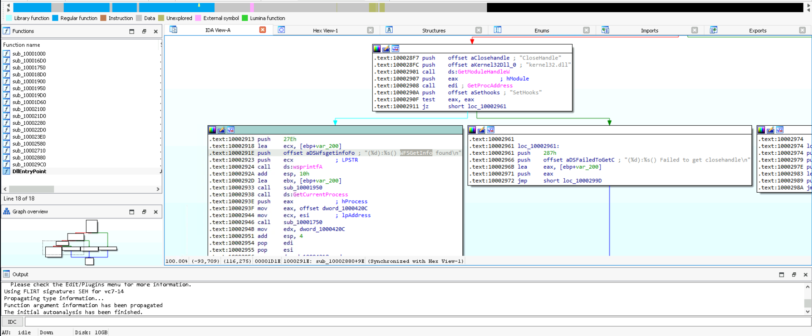

# ATMii Lab
---

Let exercise [here](https://cyberdefenders.org/blueteam-ctf-challenges/atmii/)

> Check hash: 
> executable: 3fddbf20b41e335b6b1615536b8e1292  
> library: dc42ed8e1de55185c9240f33863a6aa4  
> This lab will be relate about ATM Trojan

**Q1: Identifying the target process is crucial for understanding the injection vector. What is the name of the process into which the malicious library is injected?**

Look into Process32FirstW API, it is a sign of injection DLL into Process or something. 
Here, it try to find process has name: **atmapp.exe** to injection.

> **atmapp.exe**

**Q2: Determining the source of configuration commands can reveal the malware's operational parameters. What is the configuration file name from which the DLL takes commands?**

Observe quickly, You can see command's operators have been store here.

> **c.ini**

**Q3: The success of the injection depends on the correct file name. What should be the original name of the injected library to ensure the attack is successful?**

> **dll.dll**

**Q4: Identifying the function address where the shellcode resides helps track the malware's execution flow. What is the address within the injector that houses the shellcode responsible for loading and unloading the malicious DLL?**

Reference: https://learn.microsoft.com/en-us/windows/win32/api/memoryapi/nf-memoryapi-writeprocessmemory

> **0x00401090**

**Q5: Understanding how the malware interfaces with the ATM hardware is key to analyzing its behavior. What is the name of the dynamic library that provides APIs for interacting with the ATM?**

From this part, I will analyze with library file

> **msxfs.dll**

**Q6: Hooking functions allow malware to manipulate normal operations. What is the name of the original API function that the program hooks and redirects to its wrapper?**

Guessing with text and analyze step by step each function.

> **WFSGetInfo**

**Q7: Knowing the function the malware utilizes is essential to identifying the malware's functionality. What API function does the malware call to dispense money?**

Realy, i dont understand about content of this question. Maybe needing research more about **msxfs.dll** library.

Some interesting about msxfs.dll of chatgpt:

> **WFSExecute**

**Q8: Recognizing specific constants can help in understanding command execution. What is the name of the constant responsible for the money dispensing command, which is passed as a parameter to the API function?**

Lookup above picture, You will have right answer.

> **WFS_CMD_CDM_DISPENSE**

More information: https://github.com/GoSecure/xfsc/blob/main/cdm.cpp
