# AgentTesla


**Q1: Identifying the libraries used in malware can help understand its dependencies and potential behaviors. What is the name of the library utilized in the unpacked executable?**

Convert Scan type into Nauz File Detector(NFD), you can see below image:

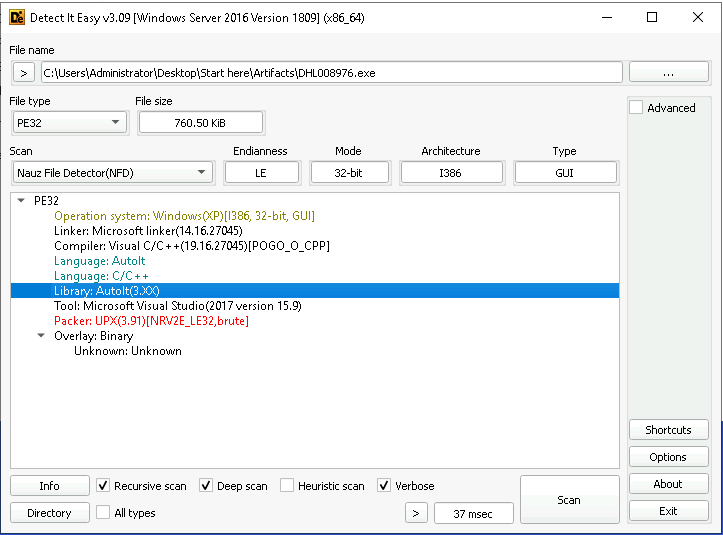

> **AutoIt**

**Q2: Determining the hash of executable components is essential for verifying integrity and identifying the malware. When the malware is executed, there are scripts running, one of them is a bin file. What is the MD5 hash of this file?**

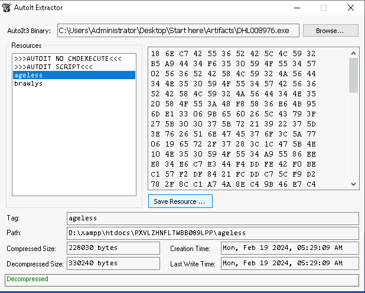

Save resource into ageless.bin in same folder with parent file.

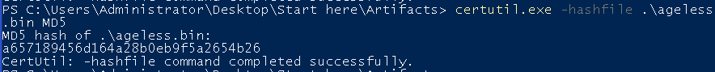

Virustotal: [a657189456d164a28b0eb9f5a2654b26](https://www.virustotal.com/gui/file/d61422391054862a499bfdb3b053f0c11b1e9d323bf7adefb4e7d76135175b27/relations)

> **a657189456d164a28b0eb9f5a2654b26**


**Q3: Recognizing key methods in the malware's code helps to pinpoint its main functionalities. What is the name of the method which has main logging functionalities such as keylogging and screen logging?**
> This question is so hard for me but Fixed tool in Server is limited. So I need move some tool into server. (pe-sieve.exe: dump process into more PE file if exist) 

Investigate process after running it. I can see a new path for image file: **C:\Users\Administrator\AppData\Local\directory**

Exactly, It will open more process with different PID (First time, I see :>> and i can't terminate process :) Holyf*ck)

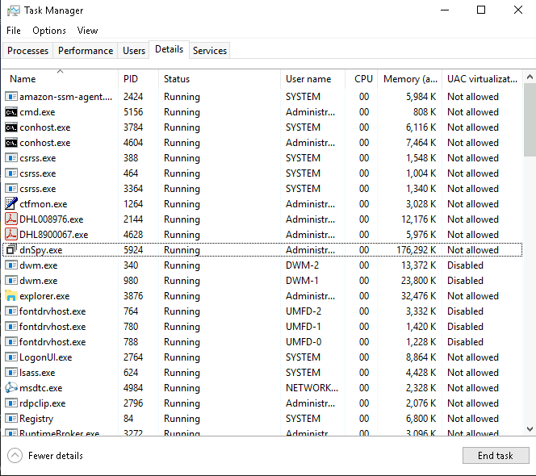

CMD to dump: `pe-sieve64.exe /shellc 0 /threads /pid 2144`

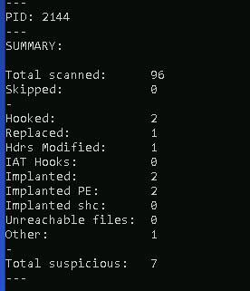

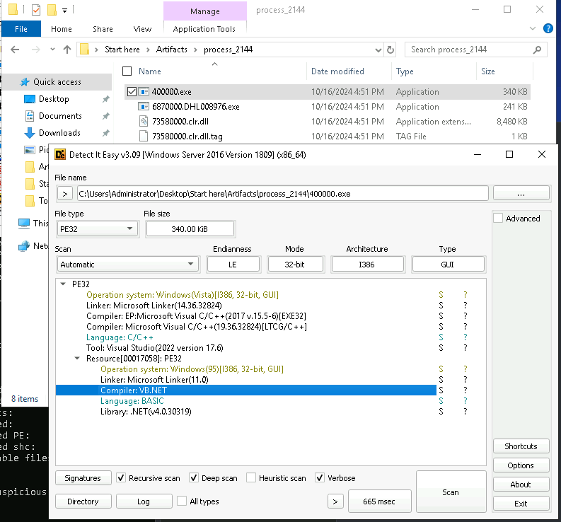

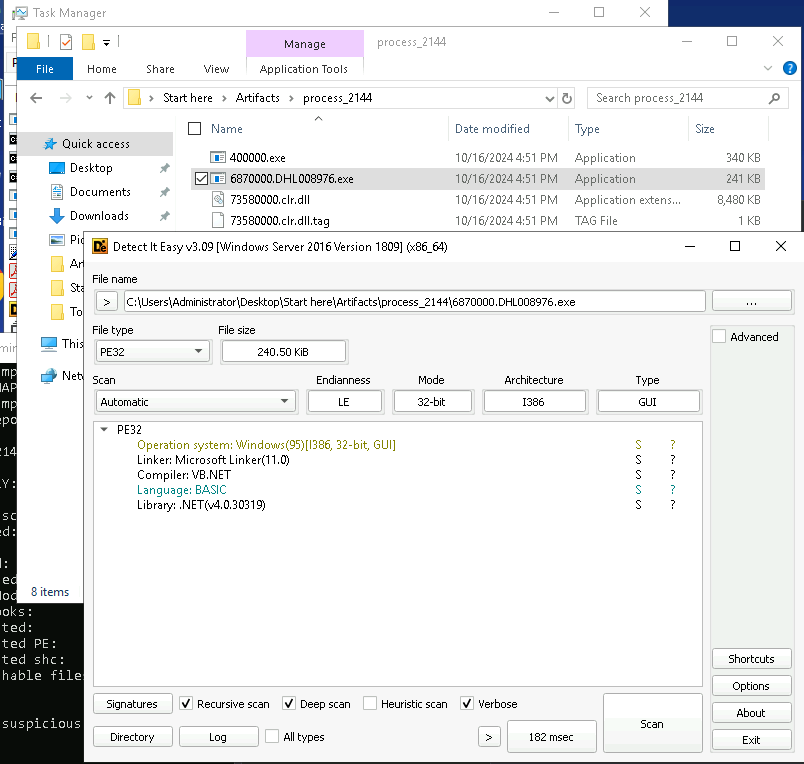

With 2 file, I can see code disassembled with **6870000.DHL008976.exe** 

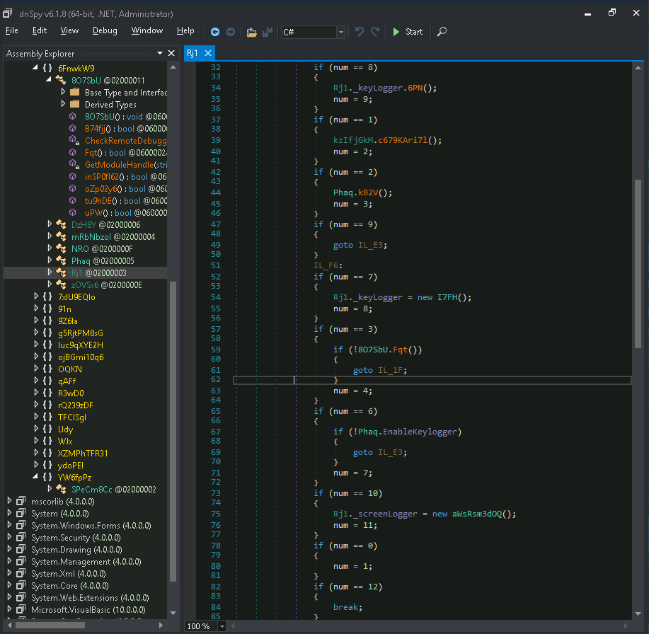

Suspicious Detected !!!

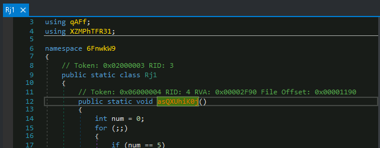

> **aaQXUhiK0j**

**Q4: Understanding the output format of keylogging functionalities assists in tracing and decoding captured data. What is the particular format (programming language format) of the output malware keylogging functionality?**

Take a look into line **48**, **74**, **86**. ALl of them are related to HTML.

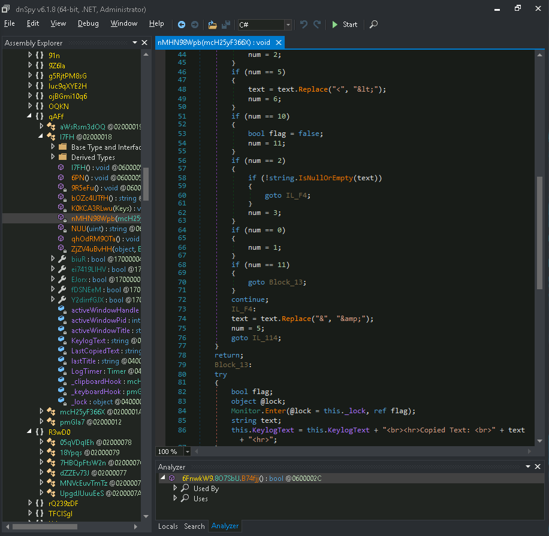

> **HTML**

**Q5: Knowing the exfiltration methods used by malware is crucial for identifying data breaches and protecting sensitive information. What is the full URL the malware uses for exfiltration of data using Telegram?**

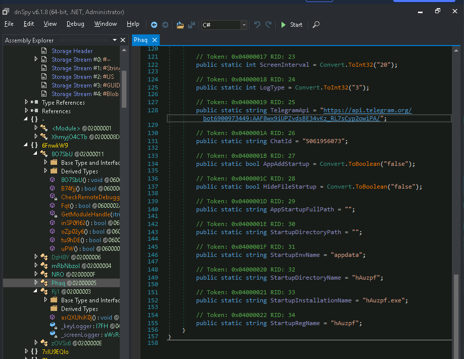

> **https://api.telegram.org/bot6900973449:AAF8wx9iUPZvdsBE34vKz_RL7sCyp2owiPA/**

**Q6: To better understand the persistence strategies of the malware, can you provide the name of the file that was dropped by the malware as part of its persistence mechanism?**

At this point, you can get MD5hash and submit into Virustotal ( **if lucky :)** ). You can see that file DHL8900067.vbs has been dropped at %AppData%\Roaming\Microsoft\Windows\Start Menu\Programs\Startup\

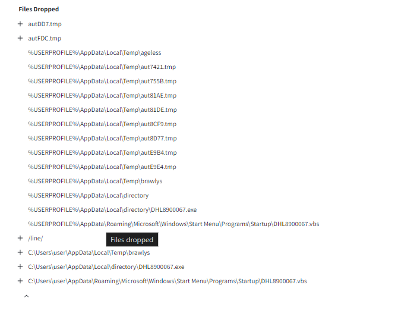

If you see in your server, you can see it in startup folder to ready for persistence 

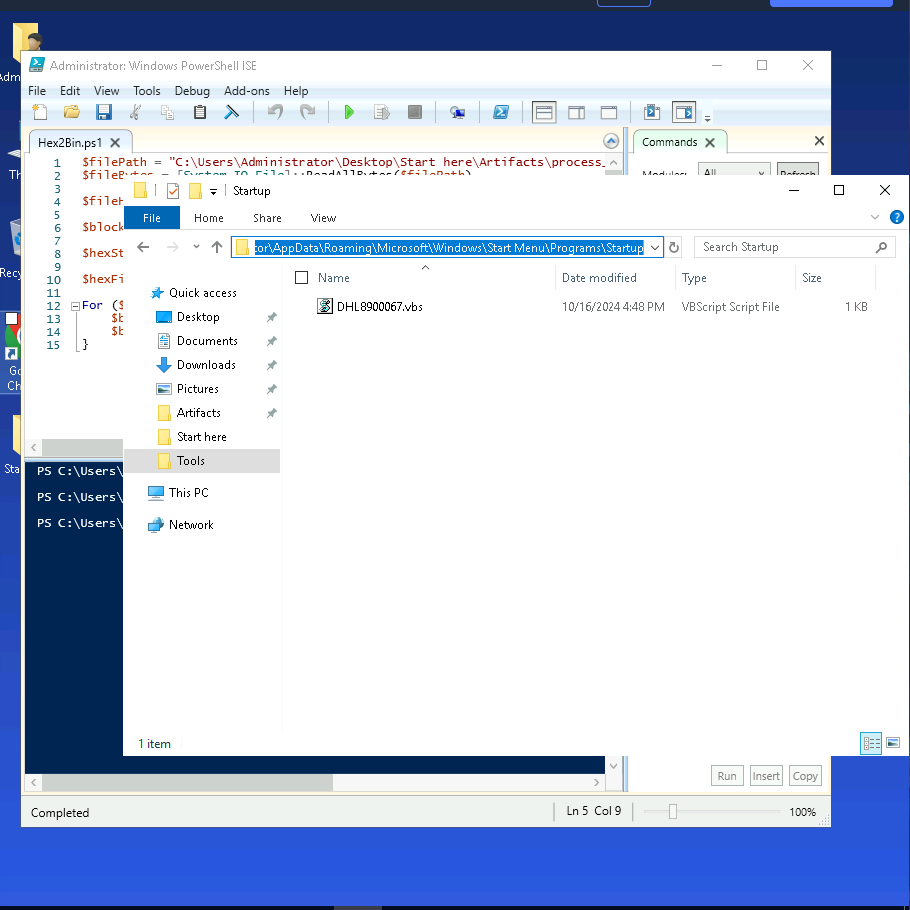

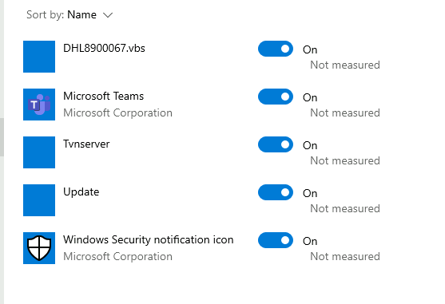

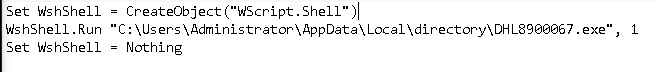


> **DHL8900067.vbs**

**Q7: Knowing the legitimate services abused by malware can aid in recognizing suspicious network activities. Which legitimate service does the malware use to get the public IP address of the victim?**

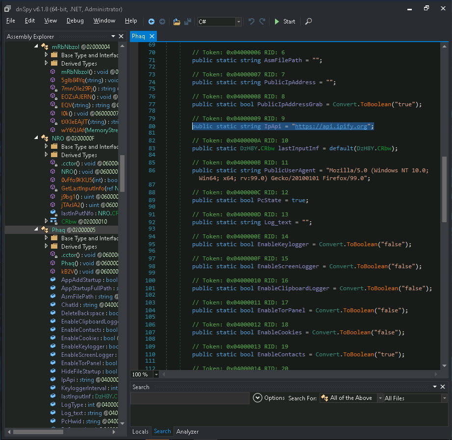

If you access into https://api.ipify.org site, you can see your public IP :>>. It's legitimate service.

> **ipify**

**Q8: Understanding the anti-VM techniques used by malware is essential for bypassing detection in analysis environments. What is the function name used for the Anti-VM technique?**

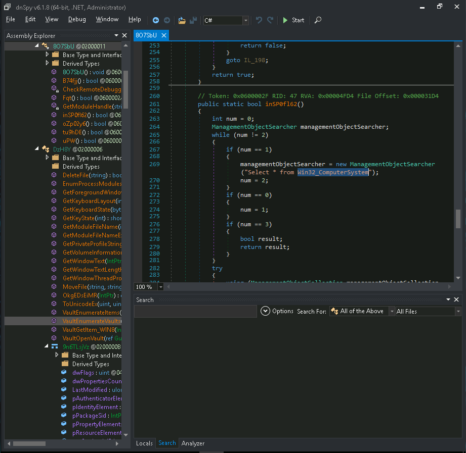

This is technique abuse WMI (Windows Management Instrumentation) to perform Anti-VM technique. You can see in below capture, It try to get Object relate VMware or VBox.

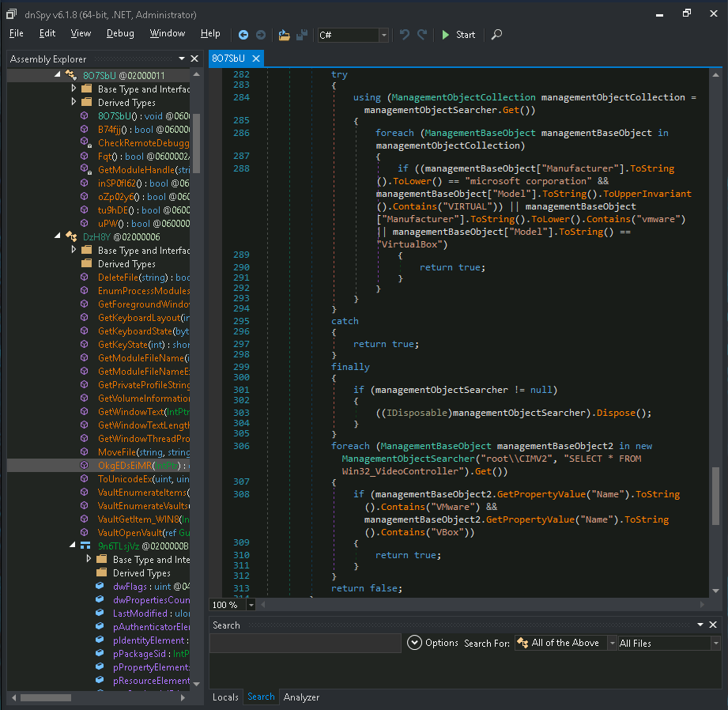

Or, You can imagine such as:
```SQL
SELECT * FROM Win32_ComputerSystem WHERE Manufacturer LIKE '%VMware%'
```

> **inSP0fl62**()

