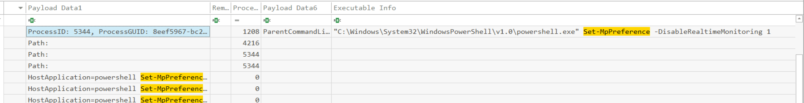
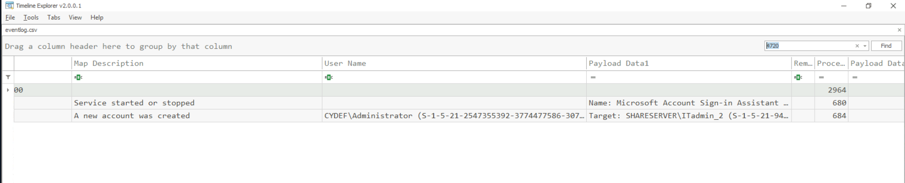

# Akira Lab
---


---
## Chall Deecription

> As a member of the DFIR team, you're tasked with investigating a ransomware attack involving Akira ransomware that has impacted critical systems. You’ve been provided with a memory dump from one of the compromised machines. Your goal is to analyze the memory for indicators of compromise, trace the ransomware’s entry point, and identify any malicious activity to assess the incident and guide the response strategy.

Tool: **EvtxCmd**, **MemProcFs**, **Volatility 3**, **Timeline Explorer**

---
## Chall Analyze

**Q1: While analyzing the memory dump, identifying the compromised machine's network domain affiliation is a crucial step in understanding the attack's scope. What is the domain to which the infected machine is joined?**

Command: 
```powershell
python 'C:\Users\Administrator\Desktop\Start Here\Tools\Memory Analysis\volatility3\vol.py' -f .\memory.dmp windows.envars.Envars > enVars.txt
```

Find key word: **USERDNSDOMAIN**

You will receive some information that is answer

> **CYDEF.ENTERPRISE**

**Q2: Identifying the shared file path accessed by the attacker is crucial for understanding the scope of the breach and determining which files may have been compromised. What is the local path of the file that was shared on the file server?**

Registry contain shared folder is: `HKLM\SYSTEM\CurrentControlSet\Services\LanmanServer\Shares`


> I have ControlSet001 and ControlSet002, readmore about it at [here](https://sec.vnpt.vn/2021/06/windows-forensic-registry-analysis-part4/#:~:text=C%C3%A2u%20tr%E1%BA%A3%20l%E1%BB%9Di%20l%C3%A0%20ControlSet001,%C4%91%C6%B0%E1%BB%A3c%20coi%20l%C3%A0%20%E2%80%9Cgood%E2%80%9D.)

Command: 
```powershell
vol3 -f .\memory.dmp windows.registry.printkey.PrintKey

vol3 -f .\memory.dmp windows.registry.printkey.PrintKey --key "ControlSet001\Services\LanmanServer\Shares" > sharesFoler.txt
```

Context of this command has been save at: [here](sharedFolder.txt)

> **Z:\Shares\data**

**Q3: Identifying the source of failed RDP connection attempts is crucial for tracing the compromised machine and analyzing the attacker's behavior. What is the IP address of the machine that attempted to connect to the file serve?**

This question, i use MemProcFS tool (powerful) to extract (dump) dump file to dist folder. Browser **M:\misc\eventlog\ffffde85619117d0-Security.evtx** with Event Properties (remember move it to another path)

Get Event ID (4625 - Login Failed)


```
An account failed to log on.

Subject:
	Security ID:		S-1-0-0
	Account Name:		-
	Account Domain:		-
	Logon ID:		0x0

Logon Type:			3

Account For Which Logon Failed:
	Security ID:		S-1-0-0
	Account Name:		Admin
	Account Domain:		CYDEF

Failure Information:
	Failure Reason:		Unknown user name or bad password.
	Status:			0xc000006d
	Sub Status:		0xc0000064

Process Information:
	Caller Process ID:	0x0
	Caller Process Name:	-

Network Information:
	Workstation Name:	HELPDESK
	Source Network Address:	192.168.60.129
	Source Port:		0

Detailed Authentication Information:
	Logon Process:		NtLmSsp 
	Authentication Package:	NTLM
	Transited Services:	-
	Package Name (NTLM only):	-
	Key Length:		0

...
```

> **192.168.60.129**

**Q4: Identifying the process name of the attacker's tool is key to tracking their actions.What is the process name of the tool used by the attacker to remotely execute commands and perform malicious activities on the compromised FileServer? Tip: Check both active and terminated or hidden processes in the memory capture.**

Using these command for list process:
```powershell
python3 vol.py -f memory.dmp windows.pslist.PsList #list all current process
python3 vol.py -f memory.dmp windows.psscan.PsScan #list all current process either terminated process
```


So suspicious

> **PsExesvc.exe**

**Q5: Identifying the attacker's initial commands reveals their intentions and the level of access they gained. What was the first command executed remotely by the attacker's tool to begin system enumeration?**

*I spent a long time for this question, if you look at url of this image, it near last picture 😃*

First, you need to using MemProcFS to get all eventviewer in `"M:\misc\eventlog"` and move it to Desktop folder for using. After, using EvtxECmd.exe tool with command:

```powershell
EvtxECmd.exe -d C:"C:\Users\Administrator\Desktop\eventlog" --csv . --csvf eventlog_cmd.csv --vss
```

Next, using TimeLineExplore.exe tool for reading csv file. Because TimeLineExplore's fields is not illogical or unclear, I was sitting before screen for a long time to discover some information:
```
Payload Data6: can contain Parent Process
payload Data1: can contain Process ID
Process ID field is not corrent or i don't know what it used for
Executable Info: is children process or command, that has been dropped by parrent process
```
Merge all above column nearly, you can see this csv file clearly same below picture


Sort by time, you can see **PSEXESVC.exe** has been executed **tasklist** firstly at **2024-09-18 11:36:40**

> **tasklist**

**Q6: Understanding how the attacker disabled security measures is key to assessing how they gained persistence and weakened the system's defenses. The attacker used a remote execution tool, which generates a different Process ID (PID) for each command executed. What is the Process ID (PID) of the first command used to turn off Windows Defender?**

*May not be coherent with the above sentence because i đid this question before question 5*

After searching powershell text in search bar, I have 3 command relate about disable monitor realtime of Windows Defender but **only 1** command is run first and right command


Command Line:
```powershell
C:\Windows\System32\WindowsPowerShell\v1.0\powershell.exe Set-MpPreference -DisableRealtimeMonitoring 1
```



> **5344**

**Q7: Identifying changes to the system's registry is essential for understanding how the attacker disabled security features, allowing malicious actions to proceed undetected. In an attempt to disable Windows Defender, the attacker modified a specific registry value. What is the name of the registry value that was added or modified under HKLM\SOFTWARE\Policies\Microsoft\Windows Defender?**


> **DisableAntiSpyware** 

**Q8: Understanding how the attacker leveraged specific system files is crucial, as it can reveal their methods for accessing sensitive data and escalating privileges. What DLL file did the attacker use in the PowerShell command to dump the targeted process for further exploitation?**


You can see powershell rundll32.dll to run MiniDump (comsvcs.dll) (lsass) to dump User Account used for escalating privileges attack.

> **comsvcs.dll**

**Q9: Investigating the creation of new accounts is crucial for identifying how the attacker maintains unauthorized access to the system. To establish persistent access, the attacker created a new user account on the compromised system. What is the name of the account that the attacker created?**

Event ID for user create is: [4720](https://learn.microsoft.com/en-us/previous-versions/windows/it-pro/windows-10/security/threat-protection/auditing/event-4720)

Browser: `"M:\misc\eventlog\ffffde85619117d0-Security.evtx"`


Or using this way:



> **ITadmin_2**

**Q10: Identifying the URL in the ransom note is vital for understanding the attacker's communication and data exposure threats. The attacker included a link to their blog where stolen data would be published if negotiations fail. What is the URL provided for communication and accessing the attacker's chat?**

To understanding attack chain of attaker, I appilied this filter in TimeLineExplore (file at question 5)


**Time tracking from 2024-09-18 11:36:40 onwards**

I have the big overview about attack chain


Look carefully, here is start time of attack chain:


```
Successful Logon -> Dropped file: PSEXESVC.exe ->  persistence through service (demand start) -> Modify/Set registry (belong to service registry) GUID:  8eef5967-b29e-66ea-0b00-000000000b00 -> exec tasklist -> Create Remote Thread -> Disable Realtime Monitoring 1 -> Running HealthCheck (true or false positive) ->
enumerated (true or false positive) -> Disable Realtime Monitoring again
```


So suspicious 🤣, it (**__PSScriptPolicyTest_0yeq0tjb.ovm.ps1**) could be malicious in next step.

Full path: `C:\Users\\Administrator.CYDEF\AppData\Local\Temp\__PSScriptPolicyTest_0yeq0tjb.ovm.ps1`

### And it is my wrong :))

Easy way is: search string in dump with command:

```powershell
.\Tools\Miscellaneous\SysinternalsSuite\strings64.exe .\Artifacts\memory.dmp | Select-String ".onion"
```


Why i choose ".onion" for searching?

Because with Ransomware as A Service Model then url in ransomware note of RaaS group is usually a Data Leak Sites (DLS) in darknet and other way, you can search in darknet or article to find this url but hardcore and time-consuming. You can read more with article about [Data Leak Site](https://www.watchguard.com/wgrd-security-hub/ransomware-tracker/dunghill-leak)

> **[https://akiralkzxzq2dsrzsrvbr2xgbbu2wgsmxryd4csgfameg52n7efvr2id.onion](https://www.watchguard.com/wgrd-security-hub/ransomware-tracker/akira)**

Thank for author about last question :))