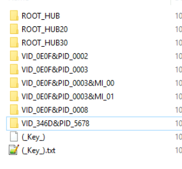
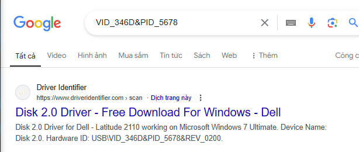

# Andromeda Bot


---
## Challenge Description
> As a member of the DFIR team at SecuTech, you're tasked with investigating a security breach affecting multiple endpoints across the organization. Alerts from different systems suggest the breach may have spread via removable devices. You’ve been provided with a memory image from one of the compromised machines. Your objective is to analyze the memory for signs of malware propagation, trace the infection’s source, and identify suspicious activity to assess the full extent of the breach and inform the response strategy.
----
## Challenge Analyze
----
**Q1: Tracking the serial number of the USB device is essential for identifying potentially unauthorized devices used in the incident, helping to trace their origin and narrow down your investigation. What is the serial number of the inserted USB device?**

Browser at: `M:\registry\HKLM\SYSTEM\ControlSet001\Enum\USB`



Or: `M:\registry\HKLM\SYSTEM\ControlSet001\Enum\USBSTOR\Disk&Ven_VendorCo&Prod_ProductCode&Rev_2.00`


You can see a USB look like different: `VID_346D&PID_5678`



Enter open it:


> **7095411056659025437&0**

**Q2: Tracking USB device activity is essential for building an incident timeline, providing a starting point for your analysis. When was the last recorded time the USB was inserted into the system?**

Value of this key is stored at: `"M:\registry\HKLM\SYSTEM\ControlSet001\Enum\USB\VID_346D&PID_5678\7095411056659025437\(_Key_).txt"`

```
ffffe200f728b000:002b6328
REG_KEY
7095411056659025437
2024-10-04 13:48:18 UTC
```
Here is last time accessed:

> **2024-10-04 13:48:18**

**Q3: Identifying the full path of the executable provides crucial evidence for tracing the origin of the attack and understanding how the malware was deployed. What is the full path of the executable that was run after the PowerShell commands disabled Windows Defender protections?**

Filter Event Log with Powershell and Microsoft-Windows-Powershell, you will can see some command to disable Realtime Monitoring funtion of Windwos Defender

```powershell
powershell.exe -ExecutionPolicy Bypass -Command Set-MpPreference -DisableRealtimeMonitoring $true; Set-MpPreference -DisableBehaviorMonitoring $true; Set-MpPreference -DisableIOAVProtection $true; Set-MpPreference -DisableScriptScanning $true; Set-MpPreference -DisableBlockAtFirstSeen $true; Set-MpPreference -DisableCloudProtection $true; Set-MpPreference -DisableArchiveScanning $true; Set-MpPreference -SubmitSamplesConsent 2; sc stop WinDefend; sc config WinDefend start= disabled; sc stop SecurityHealthService; sc config SecurityHealthService start= disabled; Start-Process 'E:\hidden\Trusted Installer.exe'
```

> **E:\hidden\Trusted Installer.exe**

**Q4: Identifying the bot malware’s C&C infrastructure is key for detecting IOCs. According to threat intelligence reports, what URL does the bot use to download its C&C file?**

You can see a log relate to WebRequest:

```
{"EventData":{"Data":[{"@Name":"ContextInfo","#text":"        Severity = Warning,         Host Name = ConsoleHost,         Host Version = 5.1.19041.1682,         Host ID = fe7b23c2-43fe-489a-b46c-d6af166ca68d,         Host Application = C:\\Windows\\System32\\WindowsPowerShell\\v1.0\\powershell.exe,         Engine Version = 5.1.19041.1682,         Runspace ID = 12458b81-0830-47c7-95ac-4872fd719c4f,         Pipeline ID = 8,         Command Name = Invoke-WebRequest,         Command Type = Cmdlet,         Script Name = ,         Command Path = ,         Sequence Number = 15,         User = DESKTOP-REEGD5A\\Tomy,         Connected User = ,         Shell ID = Microsoft.PowerShell, "},{"@Name":"UserData"},{"@Name":"Payload","#text":"Error Message = Could not find a part of the path 'C:\\Tools\\Sysmon\\sysmonconfig.xml'., Fully Qualified Error ID = System.IO.DirectoryNotFoundException,Microsoft.PowerShell.Commands.InvokeWebRequestCommand, "}]}}
```

Long time for searching in browser 🙂: [Original Article](https://cloud.google.com/blog/topics/threat-intelligence/turla-galaxy-opportunity/?hl=en) and [Virustotal](https://www.virustotal.com/gui/file/9535a9bb1ae8f620d7cbd7d9f5c20336b0fd2c78d1a7d892d76e4652dd8b2be7/behavior)


> **http://anam0rph.su/in.php**

**Q5: Understanding the IOCs for files dropped by malware is essential for gaining insights into the various stages of the malware and its execution flow. What is the MD5 hash of the dropped .exe file?**

You can see file dropped throught sysmon **event id = 11** (Created / Deleted file) OR event id = 1 (Process Created)


Get Hash:


But not correct :))

Analyze more...

Same file but it is right hash, I don't know How hash file has been changed :))


> **7FE00CC4EA8429629AC0AC610DB51993**

**Q6: Having the full file paths allows for a more complete cleanup, ensuring that all malicious components are identified and removed from the impacted locations. What is the full path of the first DLL dropped by the malware sample?**

You can see, attacker has been dropped many DLL file:


> **C:\Users\Tomy\AppData\Local\Temp\Gozekeneka.dll**

**Q7: Connecting malware to APT groups is crucial for uncovering the broader strategy, motivations, and long-term goals of an attack. Based on IOCs and threat intelligence reports, which APT group reactivated this malware for use in its campaigns?**

This is some article and report relate to IOCs:

[Joe Sandbox Cloud](https://www.joesandbox.com/analysis/1317541/1/html)
[NEC](https://www.nec.com/en/global/solutions/cybersecurity/blog/240823/index.html)

Turla team also known as UNC4210, observed across incidents in industries in Ukraine relate Andromeda botnet.

