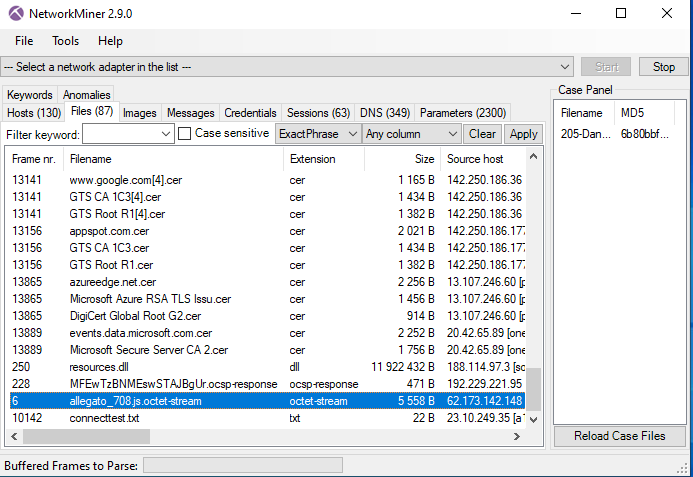
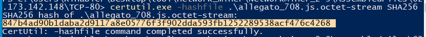
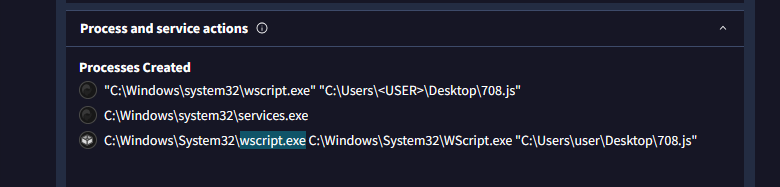
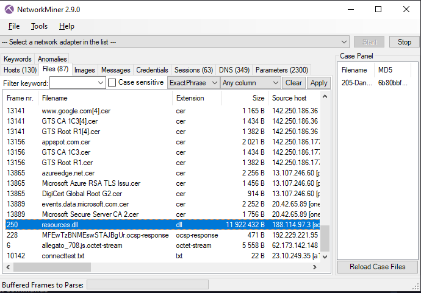
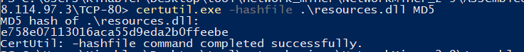
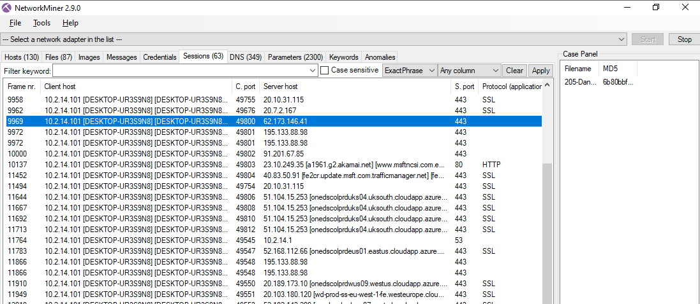
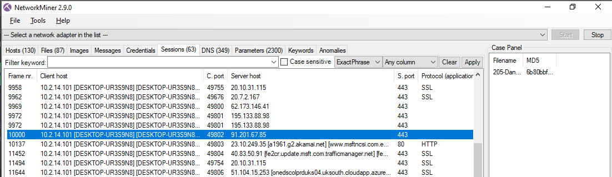

# DanaBot

> Lab Description:  
> Our SOC team detected suspicious activity in the network traffic. A machine has been compromised, and company information that should not have been there has now been stolen. It’s up to you to determine what happened and what data was taken.

**Q1: What is the malicious file name used for initial access?**

> ANSWER: **allegato_708.js**

**Q2: What is the SHA256 hash of the mentioned file?**

> ANSWER: **847b4ad90b1daba2d9117a8e05776f3f902dda593fb1252289538acf476c4268**

**Q3: What is the process used to execute the malicious file?**

> ANSWER: **wscript.exe**

**Q4: What is the extension of the second malicious file used by the attacker?**

> ANSWER: **dll**

**Q5: What is the MD5 hash of the second malicious file?**

> ANSWER: **e758e07113016aca55d9eda2b0ffeebe**

**Q6: What is the IP address used by the attacker in initial access?**

> ANSWER: **62.173.146.41**

**Q7: What is the last malicious IP address in the PCAP that is known to be used as CnC by DanaBot?**

*This question so lucky 🤣

> ANSWER: **91.201.67.85**