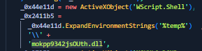

# GhostDetect Lab
---


Practice lab [here](https://cyberdefenders.org/blueteam-ctf-challenges/ghostdetect/)

---
## Lab Description
One of the employees reported receiving an email with a suspicious-looking attachment. Suspecting that a known Threat Actor may be attempting to use phishing to gain a foothold in the organization, you need to analyze the provided file and identify the threat.

LECmd: Lnk Explorer Commandline edition!

## Analyzing

**Q1: In analyzing the malware's behavior after the initial intrusion, it's crucial to understand where it attempts to establish persistence or further infection. Where were the files dropped by the malware located within the system's file structure?**


Detect suspisious action in shortcut relate HTML or HTA file **Xuzhou_Shenyang2024**

Using LECmd.exe to get more interesting information.


Full Command: 
```powershell
..\..\..\..\..\Windows\System32\cmd.exe /c start "" "mshta" "%CD%\Xuzhou_Shenyang2024.lnk"
```

Path of %CD%. Note, this env variable is only exist in Command Prompt if you try in powershell it's not exist :)) (I tried)


I cant not open file with this command normally, So i run up it and i can see something:


PDF file is allocated at **C:\Users\Administrator\AppData\Local\Temp\2**

> **C:\Users\Administrator\AppData\Local\Temp**

**Q2: The malware's communication with external servers is key to its operation. What is the URL that was used by the malware to download a secondary payload?**

After run Lnk file, I received a JavaScript file, you can get [here](Jingdezhen.js)

Lookup into last suspicious code, you can get URL:


> **https://windacarmelita.pw/picdir/big/113-1131910-clipart.svg**

**Q3: Understanding the malware's defense evasion techniques is essential for developing effective detection trategies. What encryption technique is employed by the malware to conceal its activities or payloads?**


> **Rabbit**

**Q4: Decrypting payloads is a common technique used by malware to evade initial analysis. What is the decryption key used to unlock the second stage of the malware?**

Lookup above picture, you will have answer

> **dfshji349jg843059utli**

**Q5: Malware analysis often involves tracking how it interacts with the filesystem. What is the name of the file created by the malware to store decrypted data?**



> **mokpp9342jsOUth.dll**

**Q6: Analyzing the malware's execution flow is crucial for understanding its impact and behavior. What function does the malware execute within the DLL to perform its malicious activities?**

I have been found a [link](https://cert.gov.ua/article/5661411), it is attack map relate about this lab


Here is list file: https://1275.ru/ioc/2498/ghostwriter-apt-iocs-part-3-2/

Source file: [Збірник_тез_НУОУ_23.rar](https://www.virustotal.com/gui/file/364b0b8e2cb58fccdc07d668176ecb7a70e8827cc539a9643283c255bfdb1b79)

Child file [sdfhui2kjd.js](https://www.virustotal.com/gui/file/f3d8c34443457d32de3c2687619037015e12bd2222c0e457e8c79fda2906d424)

I will analyze js file first since I can't find dll


Sample command: `rundll32.dll mokpp9342jktihh.dll, NormalizeF`

> **NormalizeF**

**Q7: Investigating related artifacts can provide insights into the broader campaign. What is the name of another JavaScript file that utilizes the domain identified during the investigation?**

> **sdfhui2kjd.js**

**Q8: Attribution is a critical aspect of threat intelligence. Can you identify which Advanced Persistent Threat (APT) group is likely behind this attack?**


> **UAC-0057**

**Q9: What is the country of origin associated with the APT group identified in this investigation?**


> **Belarus**


