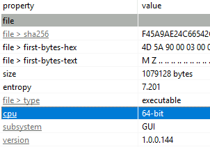
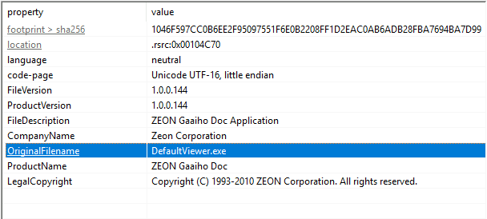
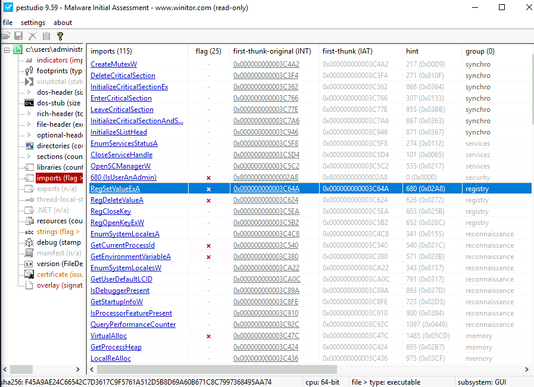
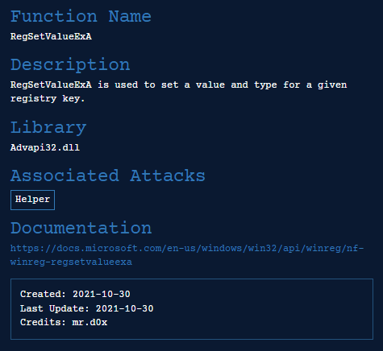
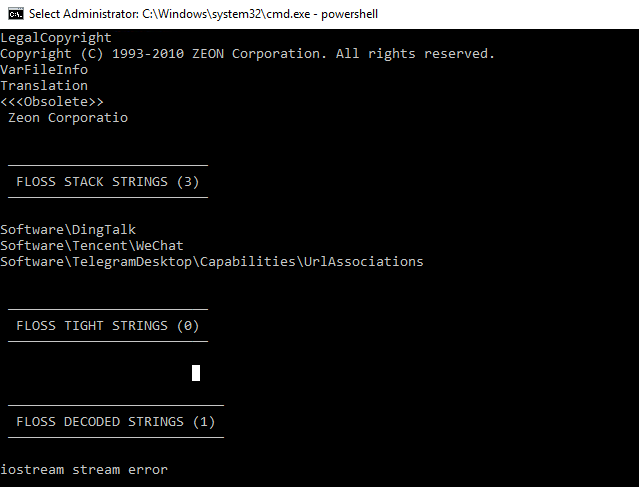
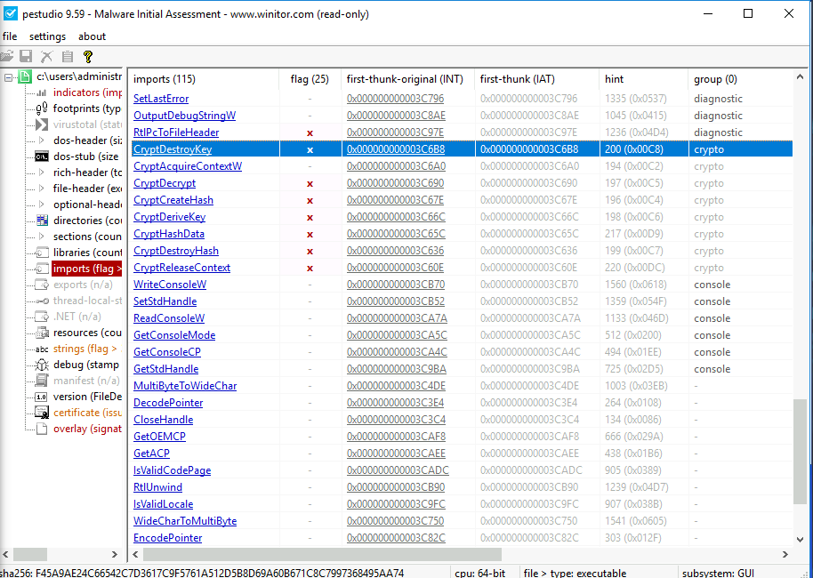
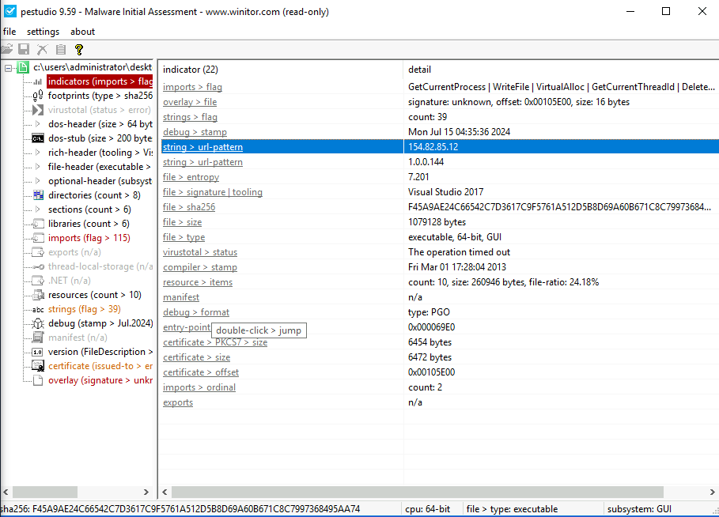
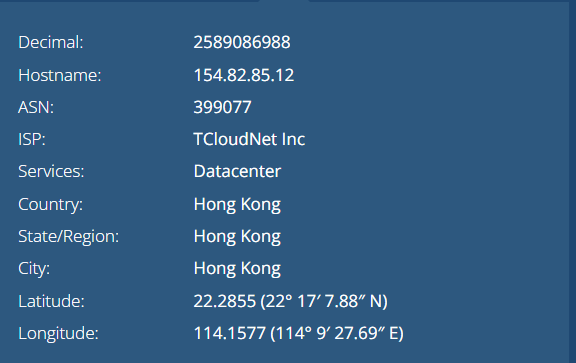
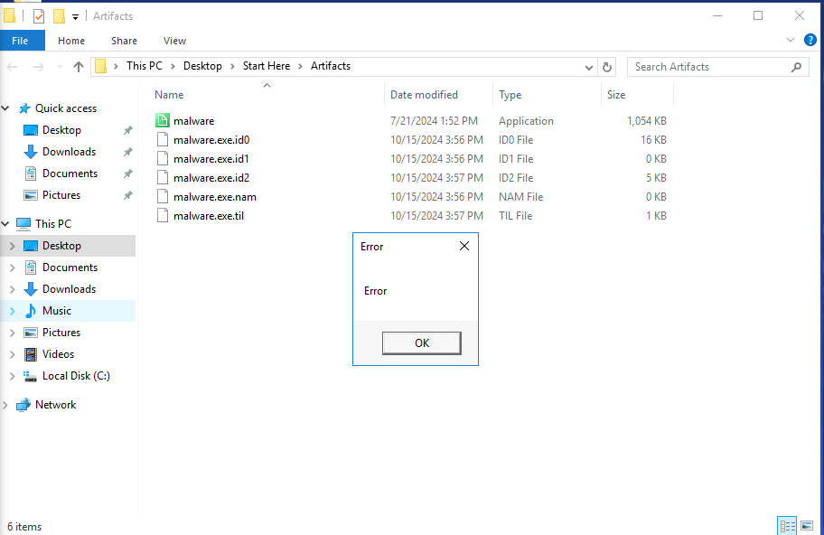
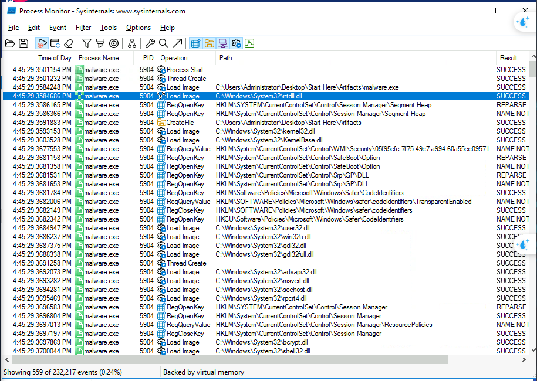

# MalaCrypt Lab

**Q1: Understanding the type of binary architecture allows us to determine the types of registers being used, What architecture is this binary built for?**

> **x64**

**Q2: Executables are sometimes renamed or altered to evade detection or disguise their true purpose. What is the original name of the executable?**

> **DefaultViewer.exe**

**Q3: Some DLL files are responsible for accessing Windows registries, Which DLL file is utilized for manipulating the Windows Registry?**

Link: https://malapi.io/winapi/RegSetValueExA 

> **Advapi32.dll**

**Q4: Certain strings may reveal specific information, What is the name of the Chinese messaging app discovered in the basic static analysis?**

Using Command Line with [Floss](https://github.com/mandiant/flare-floss) Tool 

`..\Tools\Miscellaneous\floss.exe .\malware.exe`

> **WeChat**

**Q5: The Windows API can be used for malicious purposes. Which Windows API is used to destroy previously generated encryption keys?**

> **CryptDestroyKey**

**Q6: Knowing the attacker's IP can help trace the source of the attack and gather information about their location and network, What is the IP address found in the executable that belongs to Hong Kong?**

Link: https://whatismyipaddress.com/ip/154.82.85.12

> **154.82.85.12**

**Q7: In dynamic analysis, we examine the behavior of the malware and identify any suspicious activities, What message is displayed on the screen when the binary is executed?**

> **Error**

**Q8: Identifying the executed DLLs gives us insight into the attacker's strategies and goals. What is the name of the first DLL file that is loaded after the binary is executed?**

Using Process Monitor Filter: **Process Name is malware.exe**

> **ntdll.dll**