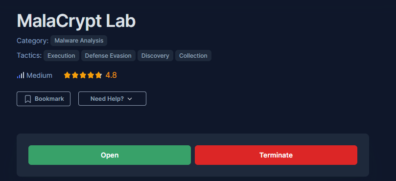
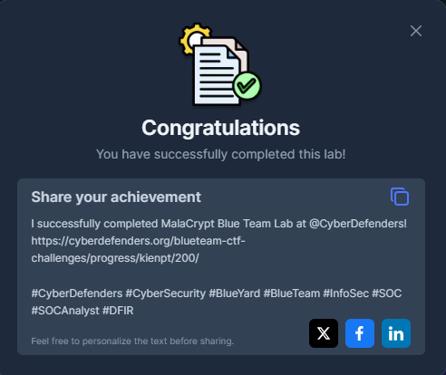

# MalaCrypt Lab

**Q1: Understanding the type of binary architecture allows us to determine the types of registers being used, What architecture is this binary built for?**

> **x64**

**Q2: Executables are sometimes renamed or altered to evade detection or disguise their true purpose. What is the original name of the executable?**

> **DefaultViewer.exe**

**Q3: Some DLL files are responsible for accessing Windows registries, Which DLL file is utilized for manipulating the Windows Registry?**

Link: https://malapi.io/winapi/RegSetValueExA 

> **Advapi32.dll**

**Q4: Certain strings may reveal specific information, What is the name of the Chinese messaging app discovered in the basic static analysis?**

Using Command Line with [Floss](https://github.com/mandiant/flare-floss) Tool 

`..\Tools\Miscellaneous\floss.exe .\malware.exe`

> **WeChat**

**Q5: The Windows API can be used for malicious purposes. Which Windows API is used to destroy previously generated encryption keys?**

> **CryptDestroyKey**

**Q6: Knowing the attacker's IP can help trace the source of the attack and gather information about their location and network, What is the IP address found in the executable that belongs to Hong Kong?**

Link: https://whatismyipaddress.com/ip/154.82.85.12

> **154.82.85.12**

**Q7: In dynamic analysis, we examine the behavior of the malware and identify any suspicious activities, What message is displayed on the screen when the binary is executed?**

> **Error**

**Q8: Identifying the executed DLLs gives us insight into the attacker's strategies and goals. What is the name of the first DLL file that is loaded after the binary is executed?**

Using Process Monitor Filter: **Process Name is malware.exe** 

> **ntdll.dll**

**Q9: Registry enumeration involves listing all the keys and values in the Windows Registry that a process has accessed to understand its structure and contents. What is the full path of the registry key associated with fallback handling in language packs that was successfully enumerated?**

Filter: set into **Show registry activity**  

> **HKLM\SOFTWARE\Microsoft\Windows NT\CurrentVersion\LanguagePack\SurrogateFallback**

**Q10: Tracing Windows API calls helps understand what the malware is intended to do by analyzing specific patterns or arguments used in these calls. What is the first Windows API call made from the function that is called from the main function?**

> GetEnvironmentVariableA (processenv.h): Retrieves the contents of the specified variable from the environment block of the calling process.

> **GetEnvironmentVariableA**

**Q11: Understanding the number of arguments passed helps identify the data type being transmitted or processed. How many arguments does the API mentioned in the previous question accept?**

Reference: [link](https://learn.microsoft.com/en-us/windows/win32/api/processenv/nf-processenv-getenvironmentvariablea)

> **3** argument have been pass or Windows API mentioned is: nSize, lpBuffer, lpName

**Q12: Identifying specific details within a binary can provide insights into the target's identity or the attacker's intent. What is the name of the company embedded in the binary?**

> **ZEON Corporation**

**Q13: Injecting shellcode through a Windows callback function involves placing the shellcode into a process and using a callback mechanism. What is the memory location of VirtualAlloc as identified in the Capa rules related to this technique?**

Click into Imports tab > Click VirtualAlloc

You will see CODE XREF to a function

> **0x140004A31**

## Think More

Set function contain VirtualAlloc into Key_point 
Press **X** key to view XREF table  

> 2 type direction: **Up** (Parent function), **Down** (Child function)
> 
Enter into parent func.  

Ref: [IsUserAnAdmin](https://learn.microsoft.com/en-us/windows/win32/api/shlobj_core/nf-shlobj_core-isuseranadmin)

You can see if this Process in running below Administrator privileges, it will be jump to **Key_point** function

Patch Program here. Edit **jnz** to **jz** and Reanalyze program. Set break point at `jz      short loc_7FF7FA0040C5`. Before, having some error in this malware's code. You must be set more than 1 breakpoint to debug program jump into where you want it will jump into :)).

> Fact: You can pass JL instruction to prevent program end early if you **set OF(overflow flag) !=  SF(sign flag)**

You can see answer for Q4 in cyberchef :))

Processing...

Ok, now, you need to prevent program running into **ExitProcess**

This is my way:

After run continue, I realized it run smoothly into where i want :))

But, It seems there aren't CreateThread, CreateRemoteThread, ... to running shellcode, I will end blog here :>>

Done

