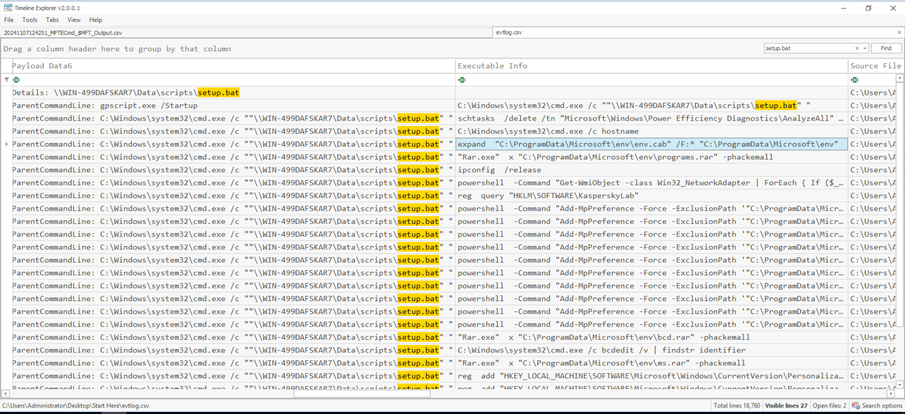

# MeteorHit
----


Link lab practice: [here](https://cyberdefenders.org/blueteam-ctf-challenges/meteorhit/)

----
## Lab Decription:
> A critical network infrastructure has encountered significant operational disruptions, leading to system outages and compromised machines. Public message boards displayed politically charged messages, and several systems were wiped, causing widespread service failures. Initial investigations reveal that attackers compromised the Active Directory (AD) system and deployed wiper malware across multiple machines.<br>
> Fortunately, during the attack, an alert employee noticed suspicious activity and immediately powered down several key systems, preventing the malware from completing its wipe across the entire network. However, the damage has already been done, and your team has been tasked with investigating the extent of the compromise.<br>
> You have been provided with forensic artifacts collected via KAPE SANS Triage from one of the affected machines to determine how the attackers gained access, the scope of the malware's deployment, and what critical systems or data were impacted before the shutdown. 

Tool:
* Registry Explorer
* Event Log Explorer
* NTFS Log Tracker
* MFTECmd
* VirusTotal

----

## Lab Analyzing
**Q1: The attack began with the use of a Group Policy Object (GPO) to execute a malicious batch file. What is the name of the malicious GPO responsible for initiating the attack by running a script?**

Load event log relate Group Policy at `"C:\Users\Administrator\Desktop\Start Here\Artifacts\C\Windows\System32\winevt\logs\Windows PowerShell.evtx"`

You can see a suspicious file has been runned.


Apply filter:


Or event Id [4016](https://learn.microsoft.com/en-us/troubleshoot/windows-server/group-policy/applying-group-policy-troubleshooting-guidance)


You can received: 


Detail:
> **Starting Scripts Extension Processing**: This means that the system has begun processing the scripts specified in the Group Policy configuration. During this phase, the scripts will be checked and executed as configured.<br>
**List of applicable Group Policy objects: (Changes were detected.)**: This line indicates that the system detected changes in the list of applicable Group Policy Objects (GPOs) for the computer or user. These changes could include adding, modifying, or removing scripts.<br>
**DeploySetup**: This is the name of a specific Group Policy Object (GPO) containing scripts that will be applied. In this case, the "DeploySetup" GPO was detected and will be processed. This GPO may contain scripts to execute during system startup, shutdown, or user logon or logoff.

**Investigate more**: 

Using Registry Explorer and import `C:\Users\Administrator\Desktop\Start Here\Artifacts\C\Windows\System32\config\SOFTWARE` and 2 log file to display all change in the registry. After that, loading save file into Registry Explorer again and browser at: `ROOT\Microsoft\Windows\CurrentVersion\Group Policy\Scripts\Startup\0\0`

You can see GPO's name at here


And this is bat file has been imported at scripts:


Path: `\\WIN-499DAFSKAR7\Data\scripts\setup.bat`

Futher more, When I loaded SYSTEM hive registry into Registry Explorer, I known that This machine's name is: **DESKTOP-VBIOB4B** which means it is different from the machine that stores the script **setup.bat**


> **DeploySetup**

**Q2: During the investigation, a specific file containing critical components necessary for the later stages of the attack was found on the system. This file, which was expanded using a built-in tool, played a crucial role in staging the malware. What is the name of the file, and where was it located on the system? Please provide the full file path.**

**Way 1**: <br>
In this question, I really check through Powrshell event log, and see a lot of file have path is: `ProgramData\Microsoft\env\`

Command: 
```powershell
MFTECmd.exe -f "C:\Users\Administrator\Desktop\Start Here\Artifacts\C\`$MFT" --csv "C:\Users\Administrator\Desktop\Start Here\MFTcmd.csv"
```

Parsing $MFT file with MFTECmd, you can see 3 path of file and submit it then second path is correct.


*I used TimelineExplorer to display content of output file*

**Way 2**:<br>
Using Event log and EvtxECmd.exe to merge all event log to csv file and filter:




You can see `C:\ProgramData\Microsoft\env\env.cab`, that used by Parent Commandline: `C:\Windows\system32\cmd.exe /c ""\\WIN-499DAFSKAR7\Data\scripts\setup.bat" "` and more

> Expand command used to uncompress or extract from **.cab** file or **dl_**\

Full command (use for later):
```powershell
expand  "C:\ProgramData\Microsoft\env\env.cab" /F:* "C:\ProgramData\Microsoft\env"
"Rar.exe"  x "C:\ProgramData\Microsoft\env\programs.rar" -phackemall
ipconfig /release
powershell  -Command "Get-WmiObject -class Win32_NetworkAdapter | ForEach { If ($_.NetEnabled) { $_.Disable() } }" 
reg  query "HKLM\SOFTWARE\KasperskyLab" 
powershell  -Command "Add-MpPreference -Force -ExclusionPath '"C:\ProgramData\Microsoft\env"\update.bat'" 
...
```

> **C:\ProgramData\Microsoft\env\env.cab**

**Q3: The attacker employed password-protected archives to conceal malicious files, making it important to uncover the password used for extraction. Identifying this password is key to accessing the contents and analyzing the attack further. What is the password used to extract the malicious files?**

From previous question, i had a command:
```powershell
"Rar.exe"  x "C:\ProgramData\Microsoft\env\programs.rar" -phackemall
```

You can see rar using option -p (password) and hackemall to unrar programs.rar compressed file

> **hackemall**

**Q4: Several commands were executed to add exclusions to Windows Defender, preventing it from scanning specific files. This behavior is commonly used by attackers to ensure that malicious files are not detected by the system's built-in antivirus. Tracking these exclusion commands is crucial for identifying which files have been protected from antivirus scans. What is the name of the first file added to the Windows Defender exclusion list?**

From question 2, several command has been filterd and first command used to add exclusions path is:
```powershell
powershell  -Command "Add-MpPreference -Force -ExclusionPath '"C:\ProgramData\Microsoft\env"\update.bat'" 
```

>**update.bat**

**Q5: A scheduled task has been configured to execute a file after a set delay. Understanding this delay is important for investigating the timing of potential malicious activity. How many seconds after the task creation time is it scheduled to run?**<br>
*Note: Consider the system's time zone when answering questions related to time.*


This is timezone of system: **Pacific Standard Time**

From question 2, you can see a command use schtasks to create a scheduler task for persistence:

```powershell
schtasks  /CREATE /SC ONCE /ST 09:08:13 /TN "mstask" /RL HIGHEST /RU SYSTEM /TR "\""C:\ProgramData\Microsoft\env\env.exe"\" C:\temp\msconf.conf"
```

at: **2024-09-24 16:04:43**

> Start time is: **09:08:13** (UTC) <br>
> Name: **mstask** <br>
> Process: `C:\ProgramData\Microsoft\env\env.exe` <br>
> Argument: `C:\temp\msconf.conf`

And this is execute time:


at: **2024-09-24 16:08:00**

**Note**: At September, system will be use **Pacific Daylight Time (PDT)** with UTC-7.
When convert fron UTC to PDT, **09:08:13 UTC** will be **16:08:13 PDT**.<br>
13 seconds slower than actually event log's time


> **210**

**Q6: After the malware execution, the wmic utility was used to unjoin the computer system from a domain or workgroup. Tracking this operation is essential for identifying system reconfigurations or unauthorized changes. What is the Process ID (PID) of the utility responsible for performing this action?**

After the malicious file has been run:


And this is wmic command:

```powershell
Parent: C:\Windows\System32\cmd.exe /c wmic computersystem where name="%%computername%%" call unjoindomainorworkgroup\
Child (finally command): wmic  computersystem where name="DESKTOP-VBIOB4B" call unjoindomainorworkgroup
```

> 7492

**Q7: The malware executed a command to delete the Windows Boot Manager, a critical component responsible for loading the operating system during startup. This action can render the system unbootable, leading to serious operational disruptions and making recovery more difficult. What command did the malware use to delete the Windows Boot Manager?**

I have 4 commands using bcdedit (Boot Configuration Data):


[](https://learn.microsoft.com/en-us/windows-hardware/manufacture/desktop/bcdedit-command-line-options?view=windows-11)

Submit all to get correct answer 😂

> **C:\Windows\Sysnative\bcdedit.exe /delete {9dea862c-5cdd-4e70-acc1-f32b344d4795}  /f**

**Q8: The malware created a scheduled task to ensure persistence and maintain control over the compromised system. This task is configured to run with elevated privileges every time the system starts, ensuring the malware continues to execute. What is the name of the scheduled task created by the malware to maintain persistence?**


Full command: 
```powershell
schtasks  /CREATE /SC ONSTART /TN "Aa153!EGzN" /RL HIGHEST /RU SYSTEM /TR "\"C:\ProgramData\Microsoft\env\env.exe\" \"C:\temp\msconf.conf\"" /F
```

> **Aa153!EGzN**

**Q9: A malicious program was used to lock the screen, preventing users from accessing the system. Investigating this malware is important to identify its behavior and mitigate its impact. What is the name of this malware? (not the filename)**

From previous question's image, I have full command:
```powershell
"C:\temp\mssetup.exe" /LOCK
```


Using this MD5: **9A49102F53291A644BD14C8202D8FBE3** and submit into Virustotal to view more

[](https://www.virustotal.com/gui/file/074bcc51b77d8e35b96ed444dc479b2878bf61bf7b07e4d7bd4cf136cc3c0dce/)


> **breakwin**

**Q10: The disk shows a pattern where malware overwrites data (potentially with zero-bytes) and then deletes it, a behavior commonly linked to Wiper malware activity. The USN (Update Sequence Number) is vital for tracking filesystem changes on an NTFS volume, enabling investigators to trace when files are created, modified, or deleted, even if they are no longer present. This is critical for building a timeline of file activity and detecting potential tampering. What is the USN associated with the deletion of the file msuser.reg?**

Using NTFS Log Tracker for solve this question

* $MFT file: `"C:\Users\Administrator\Desktop\Start Here\Artifacts\C\$MFT"`
* \$Usnjrnl:$J file: `"C:\Users\Administrator\Desktop\Start Here\Artifacts\C\$Extend\$J"`
* Log file: `"C:\Users\Administrator\Desktop\Start Here\Artifacts\C\$LogFile"`

Press **Parse**


**Start**


Jump to **\$Usnjrnl:$J**(Search Result), you can see event relate delete file:


> **11721008**