# OceanLotus Lab
---


---
## Lab Description
A spear-phishing attack has hit your organization's mail server. An unusual traffic alert from an endpoint helped to detect this breach. We have acquired a memory dump from the endpoint, and your task is to investigate it. Your objective is to analyze the dump, identify any indications of the attack, and track down its source.

Tool:
[MemProcFS](https://github.com/ufrisk/MemProcFS)

---
## Analyzing
**Q1: It is crucial to identify the primary process responsible for managing email servers to understand the entry point of a breach. What is the Process ID (PID) of the main process that handles email server operations?**

[*There will be a snapshot (.vmsn) or suspend file (.vmss) in the virtual machine directory, and a non‐monolithic memory (.vmem) file*](https://knowledge.broadcom.com/external/article/181598/how-to-convert-a-vmware-virtual-machine.html)

This memory image needs to be analyzed by MemProcFS tool

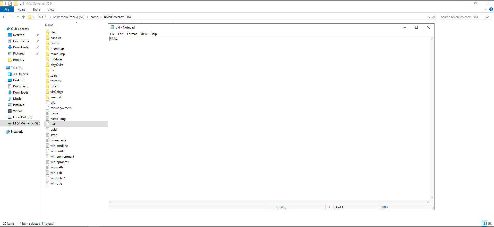

> **3584**


**Q2: To trace the origin of a spear-phishing attack, we need to know who the attacker is impersonating. What is the email address that the attacker used to spoof when they sent out phishing emails?**

Export minidump of mailserver into file and using regular expression to find email
```powershell
PS C:\Users\Administrator\Desktop\Start Here\Tools> .\Strings\strings.exe -n 8 M:\name\hMailServer.ex-3584\minidump\minidump.dmp > mail_dump.txt
```

You can see sender and receiver of a email form:

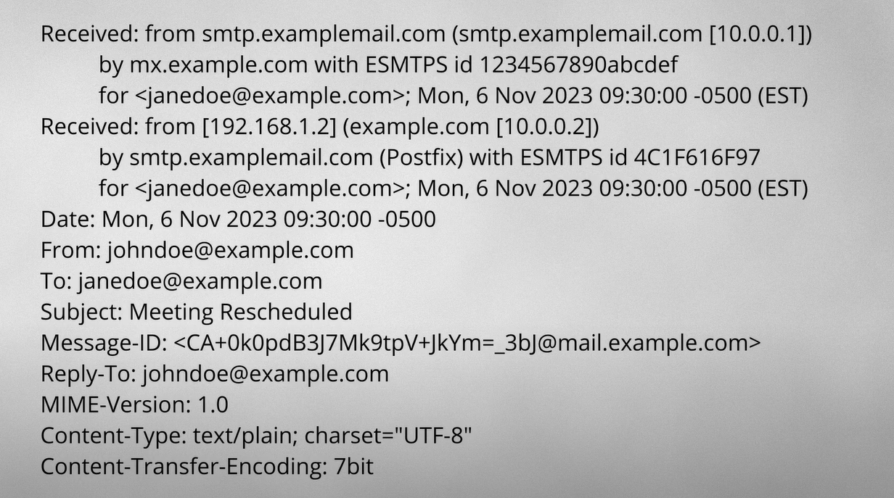

If i want to find email address that attacker used to spoof, I need to find FROM in dump

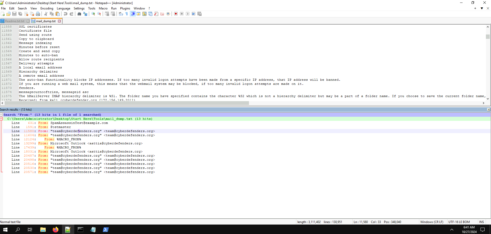

> **team@cyberdefenders.org**

**Q3: Understanding the attack's impact on individual users can help in mitigating risks, What is the email address of the user who was deceived into opening the malicious phishing email?**

```
From: Microsoft Outlook <aattia@cyberdefenders.org>
To: =?utf-8?B?QWhtZWQgQXR0aWE=?= <aattia@cyberdefenders.org>
Subject: =?utf-8?B?TWljcm9zb2Z0IE91dGxvb2sgVGVzdCBNZXNzYWdl?=
MIME-Version: 1.0
Content-Type: text/html;
    charset="utf-8"
Content-Transfer-Encoding: 8bit
This is an e-mail message sent automatically by Microsoft Outlook while testing the settings for your account.
TlRMTVNTUAABAAAAB4IIoAAAAAAAAAAAAAAAAAAAAAA=
scanme.org
TlRMTVNTUAABAAAAB4IIoAAAAAAAAAAAAAAAAAAAAAA=
!This program cannot be run in DOS mode.
...
```

It seems aattia accepted a malicious file with **exe** file format

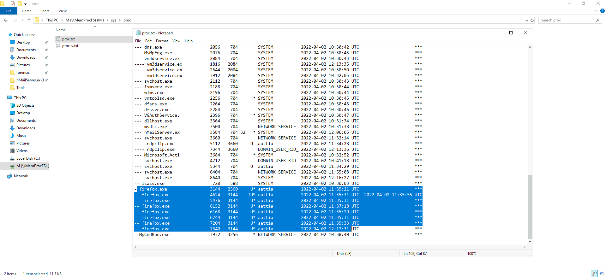

> **aattia@cyberdefenders.org**


**Q4: Accessing the compromised credentials can provide insights into the attacker's movements within the network. What password is associated with the user's email address identified in the previous question?**

Here is a sample request for movements within network (Variable will concat with **&** character). It will be valid in firefox procdump 

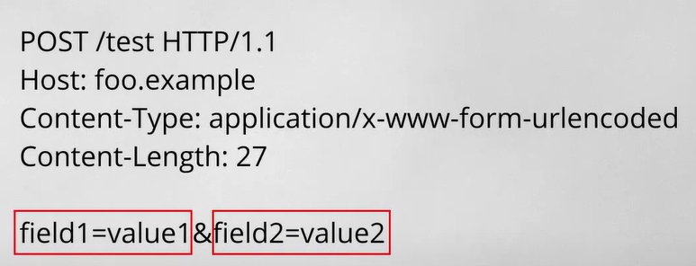

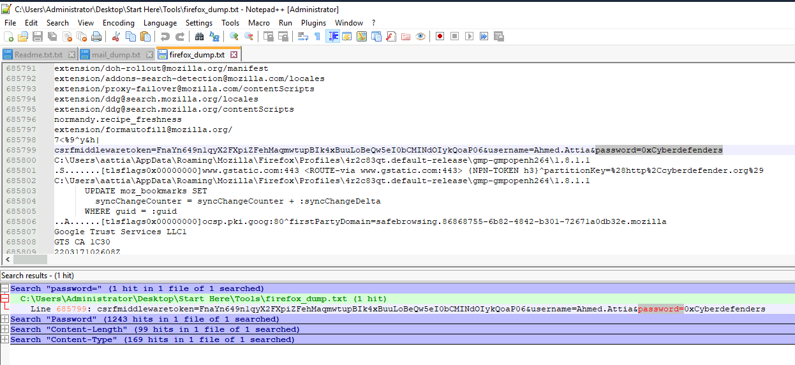

> **0xCyberdefenders**


**Q5: Uncovering the attacker's IP address is pivotal in tracing the attack's origin. What is the IP address from which the phishing emails were sent?**

Look again this picture:


You can see some IP in Received part near by email address.

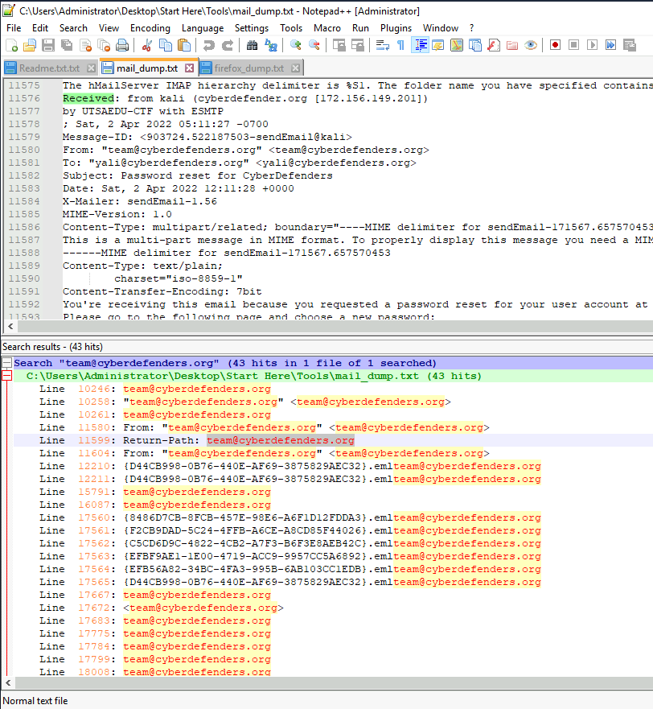

> **172.156.149.201**

**Q6: Identifying unauthorized software installations can reveal the attacker's tools and methods. What is the program name that the attacker installed on the system?**

I will identifies through Registry: `HKLM\SOFTWARE\Microsoft\Windows\CurrentVersion\Uninstall` because each program installed in local machine then it will appeared here.

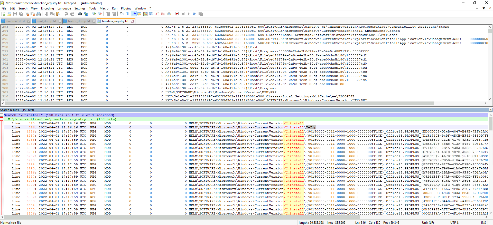

Focus to timeline of attack vector (02-04-2022), you can found the program have been installed by attacker.

> **7-zip**

**Q7: Analyzing transferred files can shed light on the attacker's intent and the scope of the breach. What is the name of the rar file that the attacker moved onto the compromised machine?**

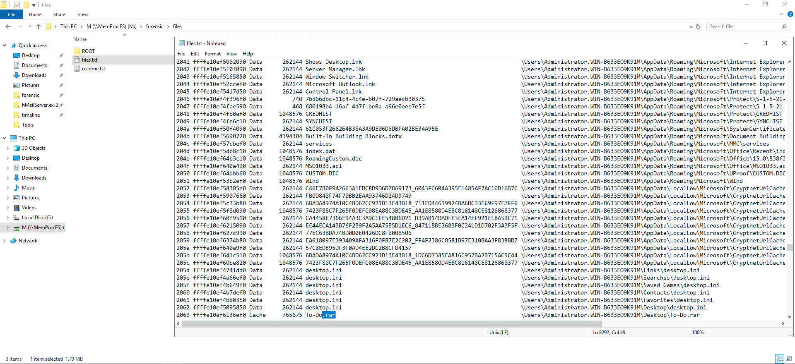

> **To-Do.rar** 

**Q8: Decoding obfuscated VBA code is key to identifying IOCs and developing custom detection rules. What is the value of the "DsCbSH1Ln" variable in the extracted macro?**

Here is the path of file has been moved by attacker: ```\Users\Administrator.WIN-B633EO9K91M\Desktop\To-Do.rar```

And you can found that file at: `M:\forensic\files\ROOT\Users\Administrator.WIN-B633EO9K91M\Desktop`

Move it to location of Artifacts and uncompress it.
After you know it doc file, using olevba.py tool to analyze:

Command: ```.\olevba.exe ..\Artifacts\ffffe10ef646cc10-To-Do\To-Do.doc --reveal```

Option: --reveal to decode obfuscated variables

Here is [malicious code](temp.bas)

**Q9: File manipulation is a common tactic used by attackers to evade detection. After the macro in the doc file dropped a malicious file, what was the new name given to the file after renaming?**

After rename function and variable, you can receive a code segment contain copy operation with a file:

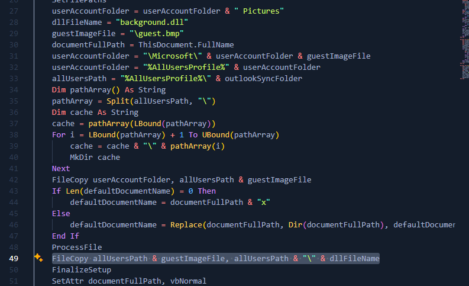

Look at line: 28 and 49

> **background.dll**

**Q10: Establishing persistence is a key objective for attackers to maintain access. What is the name of the scheduled task created by the macro for achieving persistence?**

First i use this tool for analysis mem dump, so I using hint very much :>>. Sorry if my solution is same hint.

Browser this folder **M:\forensic\timeline** you can see file **timeline_task**. Using it for solution.

Using **ShTask CRE** key for count the number of scheduler tasks have been created.

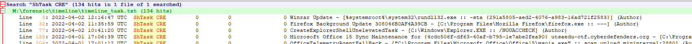

I have 3 new tasks in the same time with attack's time. 

First lines looks fake or in short it looks like it was created by an attacker. Because it trying to run dll file dropped by macro

> **Winrar Update**

**Q11: Identifying process injection is critical in understanding how the attacker evades detection. In the case of the background.dll, what is the memory address of the injected DLL?**

Here, I can see 2 process using rundll32.exe

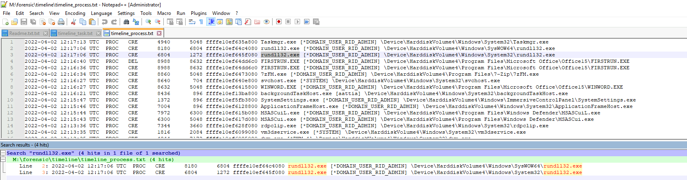

Investigate that processes

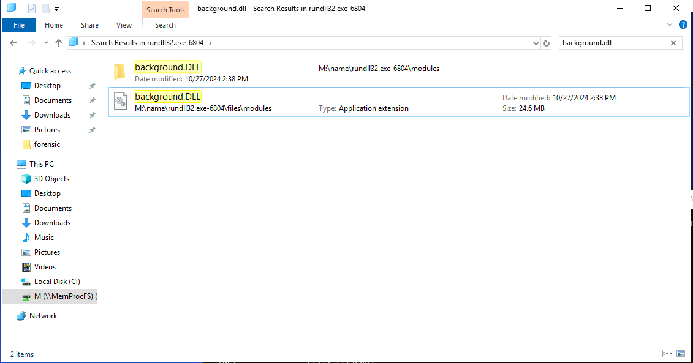

It was run at PID: 6804, don't exist at PID 8180

But i dont understand why **M:\forensic\findevil** indicate that process inject is PID 8180

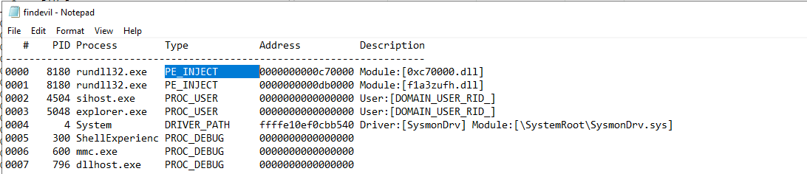

> **0xc70000**

**Q12: Understanding the communication channels the attacker uses is vital for preventing data exfiltration. What URL is utilized by the backdoor to exfiltrate data from the compromised system?**

Using **"M:\name\rundll32.exe-6804\modules\background.DLL\pefile.dll"** and strings tool for analysis this step:

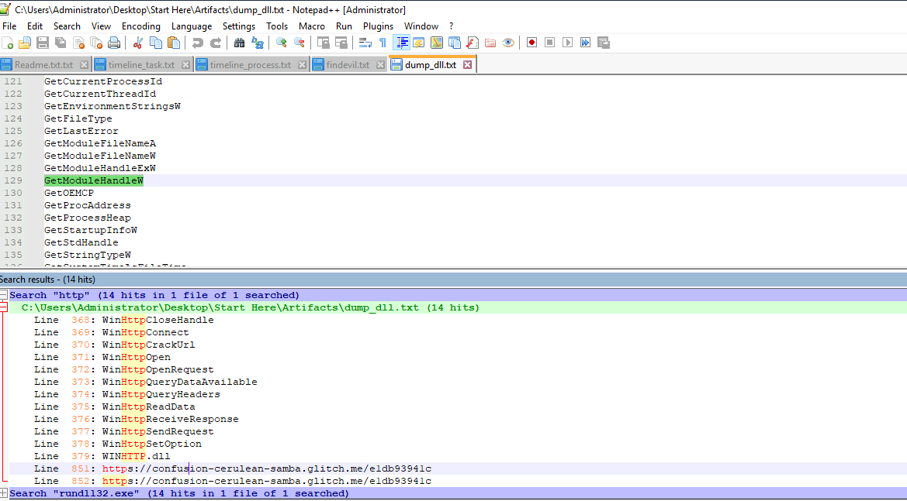

> **https://confusion-cerulean-samba.glitch.me/e1db93941c**

Done