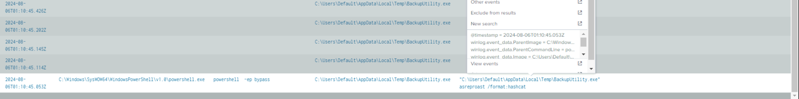

# ShadowRoast


---
## Challenge Description
> As a cybersecurity analyst at TechSecure Corp, you have been alerted to unusual activities within the company's Active Directory environment. Initial reports suggest unauthorized access and possible privilege escalation attempts.<br>
Your task is to analyze the provided logs to uncover the attack's extent and identify the malicious actions taken by the attacker. Your investigation will be crucial in mitigating the threat and securing the network.

----

## Challenge Analyze

Command to merge log:
```powershell
& '.\Tools\EZ Tools\EvtxeCmd\EvtxE
Cmd.exe' -d .\Artifacts\Office-PC\winevt\logs\ --csv . --csvf Office-PC_log.csv

& '.\Tools\EZ Tools\EvtxeCmd\EvtxE
Cmd.exe' -d .\Artifacts\DC01\winevt\Logs\ --csv . --csvf DC01_log.csv

& '.\Tools\EZ Tools\EvtxeCmd\EvtxE
Cmd.exe' -d .\Artifacts\FileServer\winevt\logs\ --csv . --csvf FileShare_log.csv
```

Begin reading at question 3 :))

**Q1: What's the malicious file name utilized by the attacker for initial access?**

From search at question 3, I can see a row


I guessing this is first of attack (initial access) because it has download path.
Full path: **C:\Users\sanderson\Downloads\AdobeUpdater.exe**

> ****AdobeUpdater.exe****

**Q2: What's the registry run key name created by the attacker for maintaining persistence once gained foothold?**

Search:
```sql
index="shadowroast" AND winlog.event_data.ParentImage="*AdobeUpdater.exe*"
| table winlog.event_data.ParentImage, winlog.event_data.Image, winlog.event_data.ParentCommandLine, winlog.event_data.CommandLine, winlog.event_data.TargetFilename
```

You can see this process call cmd 2 times:


After, I change parentImage to `C:\\Windows\\SysWOW64\\cmd.exe`, I saw that It call to Powershell with powershell  -ep bypass (Like below image)

Apply this search:
```sql
index="shadowroast" AND winlog.event_data.ParentImage="*powershell.exe*"
| table winlog.event_data.ParentImage, winlog.event_data.ParentCommandLine, winlog.event_data.Image, winlog.event_data.CommandLine, winlog.event_data.TargetFilename
```


Investigate powersehll script, I can see it is a gz archive file, After decompress, it is contain another powershell script and run another shellcode with `VirtualAlloc`, `VirtualProtect`, `CreateThread`, `WaitForSingleObject` API for shellcode injection attack. And this is a score of shellcode :))


After many search, I have been solve it 😑

Apply this seach:
```sql
index="shadowroast" AND winlog.event_data.Image="*AdobeUpdater.exe*"
| table @timestamp, winlog.event_data.ParentImage, winlog.event_data.ParentCommandLine, winlog.event_data.Image, winlog.event_data.CommandLine, winlog.event_data.TargetFilename, winlog.event_data.TargetObject
```


Registry key for persistence: `HKU\S-1-5-21-1096375878-1107820087-318151060-1105\SOFTWARE\Microsoft\Windows\CurrentVersion\Run\wyW5PZy`

> **wyW5PZy**

**Q3: What's the full path of the directory used by the attacker for storing his dropped tools?**

using this filter search, you will receive result in table:
```sql
index="shadowroast" AND winlog.event_data.Image="*Users*"
| table winlog.event_data.ParentImage, winlog.event_data.Image, winlog.event_data.ParentCommandLine, winlog.event_data.CommandLine, winlog.event_data.TargetFilename
```


You can see this Image has several execution and this is a suspicious folder :>>

Full path: **C:\Users\Default\AppData\Local\Temp\BackupUtility.exe**

**Other way**:

From Question 2, you can see at TargetFilename has 3 files used by **AdobeUpdater.exe**

It is:
```
C:\Users\Default\AppData\Local\Temp\DefragTool.exe
C:\Users\Default\AppData\Local\Temp\SystemDiagnostics.ps1
C:\Users\Default\AppData\Local\Temp\BackupUtility.exe
```

And store at: `C:\Users\Default\AppData\Local\Temp`

> **C:\Users\Default\AppData\Local\Temp**

**Q4: What tool was used by the attacker for privilege escalation and credential harvesting?**

When I investigate actions of **BackupUtility.exe**, I saw it has original file is: **Rebeus.exe** and it used some suspicious commands for [AS-REP Roasting](https://sec.vnpt.vn/2023/01/ky-thuat-attacking-kerberos-as-rep-roasting/) of attacking Kerberos:

Full Command:`"C:\Users\Default\AppData\Local\Temp\BackupUtility.exe" asreproast /format:hashcat`



View events:


In package of this [Product](https://github.com/GhostPack/Rubeus/tree/master/Rubeus/Commands), you can see some command used by BackupUtility.exe


> **Rubeus**

**Q5: Was the attacker's credential harvesting successful? If so, can you provide the compromised domain account username?**

Apply this search from this [blog](https://www.netwrix.com/as-rep-roasting.html):
```sql
index="shadowroast" AND event.code="4768"
| table _time, event.code, winlog.computer_name, winlog.event_data.SubjectDomainName, winlog.event_data.SubjectUserName, winlog.event_data.WorkstationName, winlog.event_data.TargetDomainName, winlog.event_data.TargetUserName
```


> **tcooper**

**Q6: What's the tool used by the attacker for registering a rogue Domain Controller to manipulate Active Directory data?**

I spend time for OSINT this technique:

[](https://attack.mitre.org/techniques/T1207/)

It is original of this file have detected at question 3:


Fullpath: **C:\Users\Default\AppData\Local\Temp\DefragTool.exe**

Or apply this filter:
```sql
index="shadowroast" AND mimikatz
| table _time, winlog.event_data.OriginalFileName, winlog.event_data.ParentImage, winlog.event_data.Image, winlog.event_data.ParentCommandLine, winlog.event_data.CommandLine, winlog.event_data.TargetFilename
```

You can see Original file name of tool is: mimikatz

> **mimikatz**

**Q7: What's the first command used by the attacker for enabling RDP on remote machines for lateral movement?**

using this filter search, you will receive result in table:
```sql
index="shadowroast" AND winlog.event_data.CommandLine="*reg*"
| table winlog.event_data.ParentImage, winlog.event_data.Image, winlog.event_data.ParentCommandLine, winlog.event_data.CommandLine, winlog.event_data.TargetFilename
```


You can see ParentCommandLine is: `C:\Windows\system32\wsmprovhost.exe -Embedding`

**wsmprovhost.exe** is: Windows Remote Management Provider Host, This is process that support WinRM (Windows Remote Management) and allow execute command in Windows system. Parameter **-Embedding** indicated that it is running in COM server, it was embedded in another process.

> **reg add "hklm\system\currentcontrolset\control\terminal server" /f /v fDenyTSConnections /t REG_DWORD /d 0**

**Q8: What's the file name created by the attacker after compressing confidential files?**

From this question 7, I applied this filter:
```sql
index="shadowroast" AND winlog.event_data.ParentCommandLine="C:\\Windows\\system32\\wsmprovhost.exe -Embedding"
| table _time, winlog.event_data.OriginalFileName, winlog.event_data.ParentImage, winlog.event_data.Image, winlog.event_data.ParentCommandLine, winlog.event_data.CommandLine, winlog.event_data.TargetFilename, winlog.event_data.CurrentDirectory
```


You can see Directory: `C:\Users\tcooper\Documents\` is used multiple times

After filter many times 🤣, I can found the filter, that could be help found the result:
```sql
index="shadowroast" ("*\\Users\\*" OR "*\\Backup*")   "winlog.event_data.Image"!="C:\\Windows\\system32\\svchost.exe"  "winlog.event_data.Image"!="E:\\KAPE\\kape.exe" | table  _time, winlog.event_data.OriginalFileName, winlog.event_data.ParentImage, winlog.event_data.Image, winlog.event_data.ParentCommandLine, winlog.event_data.CommandLine, winlog.event_data.TargetFilename, winlog.event_data.CurrentDirectory
```
*Original filter is denide Exclude 2 folder that you can see above filter.*


*you can see multiple splunk's tab for many filters* 😂

Full path: 	`C:\Users\Default\AppData\Local\Temp\CrashDump.zip`

> **CrashDump.zip**

## Quote: Everything in Splunk 😌